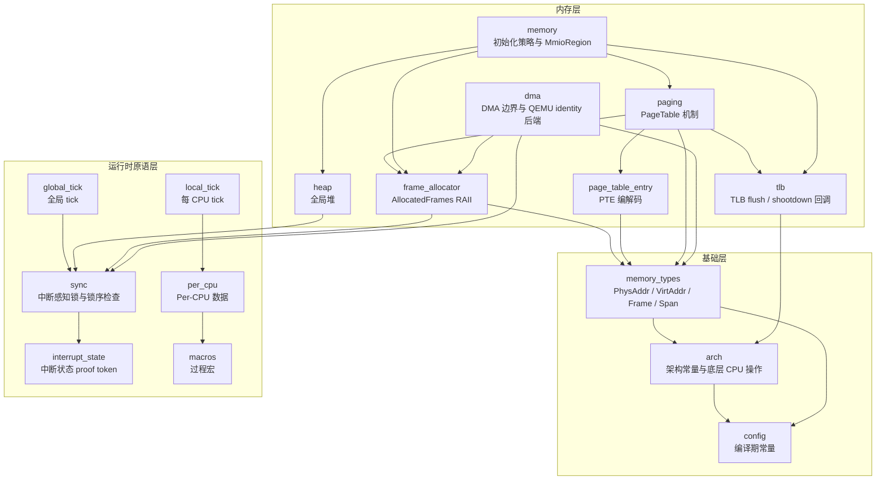
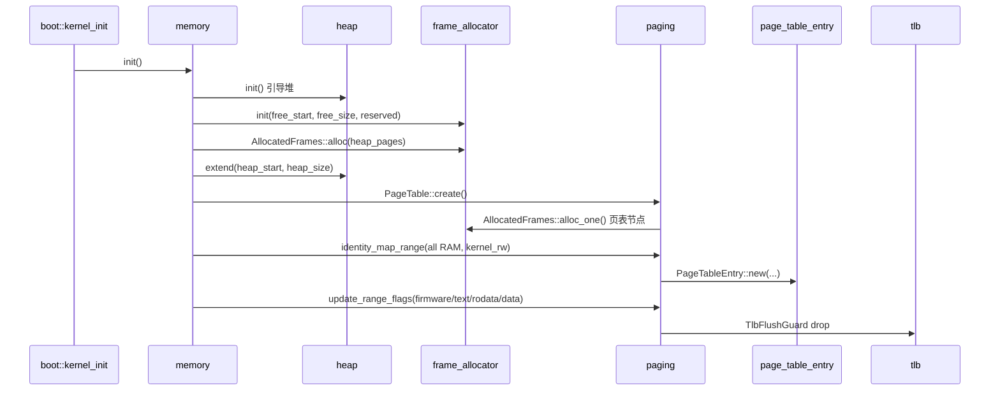
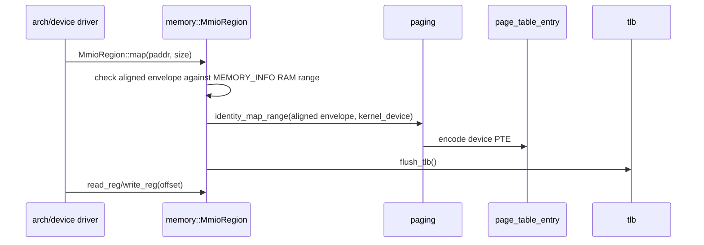
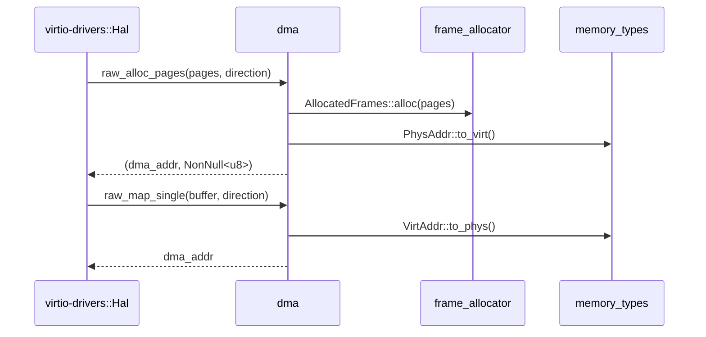

<!-- Copyright The SimpleKernel Contributors -->

# AGENTS.md — crates/

本目录包含 SimpleKernel 的 workspace 子 crate。每个 crate 只暴露一个窄边界，
上层通过类型、trait 或门面函数组合这些能力；不要在上层绕过既有边界直接访问底层实现细节。

## 分层总览

## Crate 职责

| Crate | 所属层 | 职责 | 不负责 |
|-------|--------|------|--------|
| `config` | 基础层 | 编译期常量和静态不变量 | 运行时配置、硬件探测 |
| `arch` | 基础层 | 架构常量、页表层级、TLB/中断底层操作 | 持有内核全局状态 |
| `memory_types` | 基础层 | 类型安全地址、帧号和半开区间 | 分配、页表 walk、权限策略 |
| `interrupt_state` | 运行时原语层 | 中断开关状态、`HeldInterrupts` proof token | 锁实现、调度 |
| `sync` | 运行时原语层 | `SpinLock`、`SpinLockIrq`、锁级别检查 | 业务状态管理 |
| `macros` | 运行时原语层 | `#[cpu_local]` 等过程宏 | 运行时 per-CPU 存储 |
| `per_cpu` | 运行时原语层 | Per-CPU 区域初始化与 `CpuLocal<T>` 访问 | 调度策略 |
| `global_tick` | 运行时原语层 | 全局单调 tick | 本核调度计时 |
| `local_tick` | 运行时原语层 | 每 CPU tick 计数 | 全局时间源 |
| `heap` | 内存层 | `#[global_allocator]`，两阶段堆初始化 | 物理帧选择、页表映射 |
| `frame_allocator` | 内存层 | 物理帧分配和 `AllocatedFrames` RAII 所有权 | 清零策略、PTE 权限、DMA 语义 |
| `page_table_entry` | 内存层 | RISC-V/AArch64 PTE bit-level 编解码 | 页表遍历、TLB 刷新 |
| `tlb` | 内存层 | 本核 TLB flush 和跨核 shootdown 回调入口 | IPI 传输实现、PTE 写入 |
| `paging` | 内存层 | `PageTable` walk、identity map、权限覆盖 | 内存布局策略、MMIO volatile 访问 |
| `memory` | 内存层 | 主核/从核内存初始化、`MEMORY_INFO`、`MmioRegion` | 帧生命周期后端、设备 DMA cache 语义 |
| `dma` | 内存层 | SimpleKernel DMA wrapper 和 QEMU VirtIO identity 后端 | 真机 non-coherent DMA 完整语义 |

## 组合调用关系

### 启动期内存路径

### MMIO 路径

### DMA 路径

当前 `dma` crate 只承诺 QEMU VirtIO identity mapping。真机 non-coherent DMA 仍需要
cache maintenance、DMA-safe PTE 属性和设备 capability 设计，不要把 QEMU 路径误写成通用硬件保证。

## 修改规则

| 改动 | 必须同步更新 |
|------|--------------|
| crate 公开 API 变化 | 调用方、对应测试、crate-local README/AGENTS、本文件 |
| 内存层职责或依赖变化 | `docs/design/memory-subsystem-v2.md`、相关 ADR |
| DMA 语义变化 | `crates/dma/README.md`、`docs/adr/014-qemu-virtio-dma-api-wrapper.md` 或新 ADR |
| 锁语义变化 | `crates/sync/README.md`、锁级别说明和相关测试 |
| 命令或验证入口变化 | 根 `README.md`、`docs/docker.md`、`xtask/README.md` |

## 文档边界

- `AGENTS.md` 记录长期边界、依赖方向和修改规则。
- crate `README.md` 记录用法、公共 API 和示例。
- `docs/design/` 记录当前子系统设计；当设计文档和代码冲突时，以代码为准并同步文档。
- `docs/adr/` 记录已经做出的架构决策；AI 新增 ADR 初始状态必须为“提议”。
