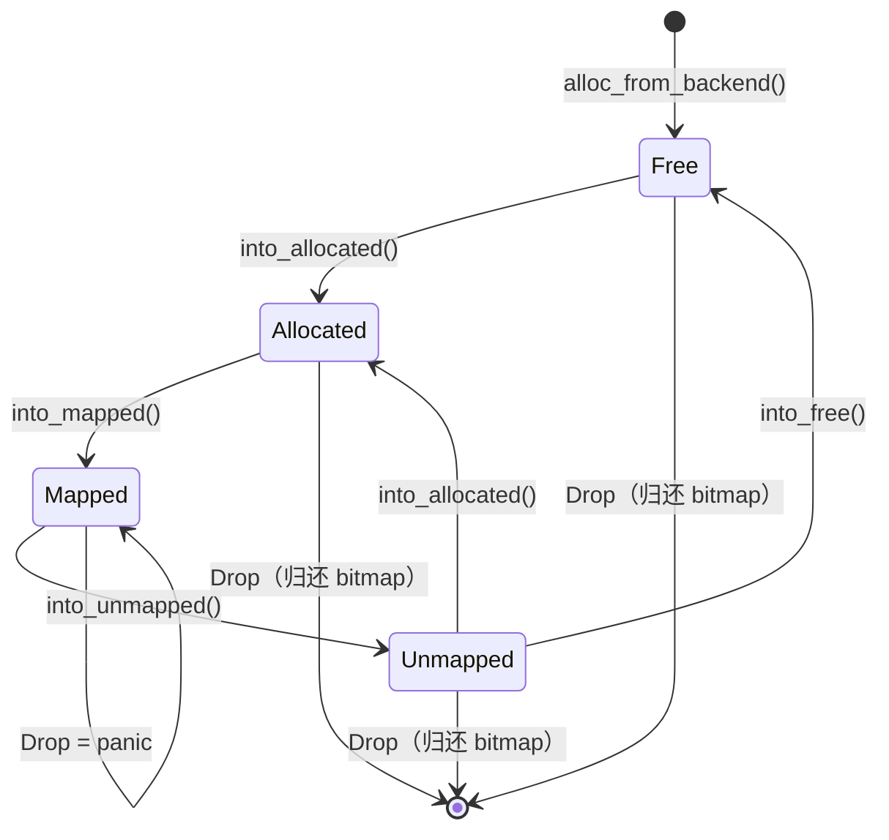

# frame_allocator

物理帧分配器——以 typestate 模式在编译期追踪帧的生命周期。

## 概览

`frame_allocator` 管理内核的物理页帧（4KB / `PAGE_SIZE` 粒度），提供分配、释放、
状态转换三类操作。核心设计是将帧的生命周期（空闲 -> 已分配 -> 已映射 -> 已解映射 -> 空闲）
编码为 Rust 的 const generic 类型参数，使非法的状态转换在编译期被拒绝。

从 `memory` crate 独立出来的原因：帧分配是内存子系统中最底层、最独立的能力，
被页表（`paging`）、映射管理（`MappedPages`）、VMA 等上层模块共同依赖。
独立 crate 使依赖方向单向化，也允许 `paging` 直接集成，无需经过 `memory`。

## 状态机

核心类型定义：

```rust
pub enum MemoryState { Free, Allocated, Mapped, Unmapped }

pub struct Frames<const S: MemoryState, P: PageSize = Page4K> {
    range: FrameSpan,   // 连续物理帧范围 [start, end)
}

pub type FreeFrames      = Frames<{ MemoryState::Free }>;
pub type AllocatedFrames = Frames<{ MemoryState::Allocated }>;
pub type MappedFrames    = Frames<{ MemoryState::Mapped }>;
pub type UnmappedFrames  = Frames<{ MemoryState::Unmapped }>;
```

`MemoryState` 是一个枚举，通过 const generic 参数 `const S: MemoryState` 嵌入类型。
不同状态是**不同类型**（`Frames<{Free}>` != `Frames<{Allocated}>`），
状态转换方法消费 self 并返回新状态的实例，编译器自动阻止对旧实例的使用。



| 状态 | 含义 | 所有者 | Drop 行为 |
|------|------|--------|-----------|
| `Free` | 刚从 bitmap allocator 取出，尚未交给用户 | 分配器内部 | 归还 bitmap |
| `Allocated` | 用户持有，可写入/映射 | 调用方 | 归还 bitmap |
| `Mapped` | 已写入页表，正在被 MMU 使用 | MappedPages | **panic**——必须先 unmap |
| `Unmapped` | 已从页表移除，等待回收或重新映射 | 调用方 | 归还 bitmap |

**编译期阻止的非法操作：**

- `MappedFrames` 上没有 `into_allocated()` 方法——无法跳过 unmap 直接回收
- `FreeFrames` 上没有 `into_mapped()` 方法——无法跳过分配直接映射
- 状态转换消费 self——转换后原变量不可用

**运行时兜底：**

- `Frames<Mapped>` 的 Drop 会 panic，捕获编译期漏网的映射泄漏

## 模块结构

```
src/
├── lib.rs           crate 入口，pub use 汇总 + ensure_test_init
├── error.rs         FrameAllocError 定义
├── state.rs         MemoryState 枚举、Frames<S> 结构体、通用操作、Drop
├── alloc.rs         全局 SpinLockIrq<BitmapAllocator>、init / alloc / dealloc
└── transitions.rs   各状态的 impl 块（状态转换方法 + 分配接口）、测试
```

模块间依赖方向：

```
transitions.rs --> state.rs <-- alloc.rs
                       ^             ^
                   error.rs      (bitmap_system_allocator 外部 crate)
```

- `state.rs` 定义类型和 Drop（调用 `alloc::dealloc_to_backend`）
- `alloc.rs` 封装 bitmap allocator（构造 `state::FreeFrames`）
- `transitions.rs` 组装两者，提供面向用户的 API
- `state.rs` 和 `alloc.rs` 存在 crate 内双向依赖——这是有意为之，对外不可见

## 分配与释放路径

### 分配

```
AllocatedFrames::alloc(count)
  |
  +-> alloc_from_bitmap(count)          <- 持有 SpinLockIrq
  |     +-> bitmap.alloc(count)
  |     +-> 构造 FreeFrames            <- 释放锁
  |
  +-> FreeFrames::into_allocated()     <- typestate 转换（零开销）
  |
  +-> write_bytes(ptr, 0, ...)         <- 零初始化（锁外执行）
```

关键设计：零初始化在锁外执行，避免持锁期间做 O(n) 的内存写入。

### 释放

```
drop(AllocatedFrames)  或  drop(UnmappedFrames)  或  drop(FreeFrames)
  |
  +-> dealloc_to_backend(range)          <- 持有 SpinLockIrq
        +-> bitmap.dealloc(start, count)
```

`Frames<Mapped>` 的 Drop 不走此路径——直接 panic。正常流程中 `MappedFrames`
的所有权由 `MappedPages` 通过 `ManuallyDrop` 管理，unmap 时通过
`into_unmapped()` 转换后安全归还。

## 锁与中断安全

全局分配器使用 `SpinLockIrq`（获取时关中断，释放时恢复），而非普通 `SpinLock`。

**原因：** 帧分配可能在中断上下文中被调用（如 page fault handler 分配新帧）。
如果使用普通 `SpinLock`：

1. 线程持有锁 -> 中断到来 -> 同核心进入 handler
2. Handler 尝试分配帧 -> 拿同一把锁 -> **死锁**

`SpinLockIrq` 在获取锁前禁用中断，消除了这一场景。代价是每次 lock/unlock
多一条 CSR/MSR 指令（~2 周期），对于帧分配的频率来说可以忽略。

## Feature Flags

| Feature | 作用 | 使用场景 |
|---------|------|----------|
| `test-support` | 导出 `ensure_test_init()`、禁用 `no_std` | 下游 crate 的 `[dev-dependencies]` |

### `test-support`

导出 `ensure_test_init()` 函数——在宿主机上分配一块堆内存模拟物理内存区域，
用 `std::sync::Once` 保证幂等，供下游 crate 的 `#[test]` 使用。

### `test-support` 的 Cargo.toml 配置

**必须通过 `[dev-dependencies]` 启用，不能放在 `[dependencies]`。**
该 feature 会禁用 `#![no_std]` 以获取 `std::sync::Once`。如果放在
`[dependencies]` 中，裸机交叉编译会因找不到 `std` 而失败。

```toml
# 正确
[dev-dependencies]
frame_allocator = { path = "../frame_allocator", features = ["test-support"] }

# 错误——裸机编译会失败
[dependencies]
frame_allocator = { path = "../frame_allocator", features = ["test-support"] }
```

## 使用示例

### 基本分配与释放

```rust
// 分配 1 帧（4KB），内容已清零
let frame = AllocatedFrames::alloc_one()?;
let pa = frame.start_paddr();

// 分配 4 个连续帧
let frames = AllocatedFrames::alloc(4)?;
assert_eq!(frames.count(), 4);

// drop 时自动归还 bitmap allocator
```

### 完整生命周期（配合页表）

```rust
// 1. 分配
let allocated = AllocatedFrames::alloc_one()?;

// 2. 写入页表后，转为 Mapped
//    （实际由 MappedPages::map 内部完成）
let mapped = allocated.into_mapped();

// 3. 从页表移除后，转为 Unmapped
let unmapped = mapped.into_unmapped();

// 4a. 重新映射到其他页表
let reallocated = unmapped.into_allocated();

// 4b. 或显式释放
// let free = unmapped.into_free();
```

## 注意事项与陷阱

### 1. `Mapped` 帧禁止直接 drop

`Frames<Mapped>` 的 Drop 会 **panic**。这是有意为之：如果映射中的帧被释放，
MMU 仍然持有对该物理地址的引用，后续访问将导致 use-after-free。

正确的释放路径是先 unmap（`into_unmapped()`），再 drop 或 `into_free()`。

### 2. 所有分配均零初始化

当前 `alloc()` / `alloc_one()` 始终将帧内容清零，防止信息泄漏（用户进程不应
看到前一个进程的数据）。这意味着即使内核内部分配（如页表节点）也会付出清零开销。

### 3. 连续帧分配受 bitmap allocator 限制

`alloc(count)` 要求 count 个**物理连续**的帧。bitmap allocator 的最大阶为 32，
在内存碎片化严重时，大块连续分配可能失败即使总空闲帧数充足。

### 4. 初始化顺序依赖

`frame_allocator::init()` 必须在堆初始化之后、任何帧分配之前调用。
未初始化时调用 `alloc()` 返回 `FrameAllocError::AllocationFailed`。

## TODO

### Per-CPU 帧缓存

当前所有核心竞争同一把全局锁。引入用户进程后，帧分配频率会显著上升，
需要 per-CPU 本地缓存消除锁争抢。设计方案详见 `alloc.rs` 顶部 TODO 注释。

### OOM 回收

当前 OOM 直接返回错误。应尝试回收可淘汰的页缓存或 swap out，
再重试分配。

### `alloc_uninit()`

为内核内部分配（页表节点、已知会立即覆写的缓冲区）提供跳过零初始化的快速路径。
