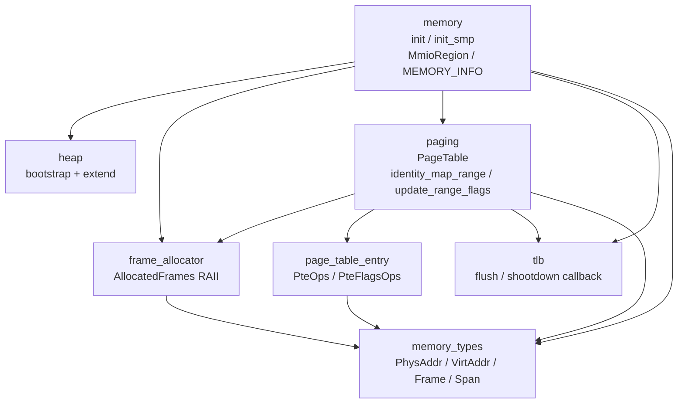
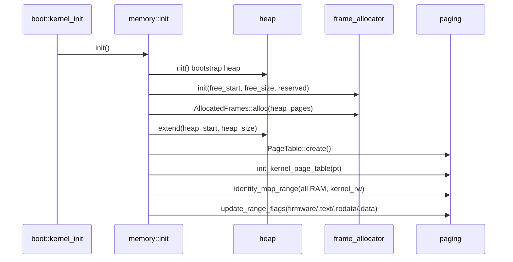

# AGENTS.md — crates/memory

本 crate 是内核内存管理门面，统一编排子系统初始化，并提供 MMIO 类型化访问。

## 职责

`memory` 是内存子系统的策略层，对外暴露：

- `init()` / `init_smp()`：主核 / 从核内存初始化编排。
- `MmioRegion`：MMIO 类型化映射，构造即建立 Device 权限 identity 映射，并提供 volatile 读写接口。
- `MEMORY_INFO`：全局内存布局，包括物理内存起止、内核镜像起止。

完整设计见 [memory-subsystem-v2.md](../../docs/design/memory-subsystem-v2.md)。

具体机制由下层 crate 实现：

- 页表 walk 和权限覆盖在 `paging`。
- 物理帧生命周期在 `frame_allocator`。
- PTE 位编码在 `page_table_entry`。
- TLB flush / shootdown 回调入口在 `tlb`。
- 地址、帧号和区间类型在 `memory_types`。

本 crate 只负责编排顺序和跨模块业务校验，例如 MMIO 与 RAM 范围的重叠检查。

## 子系统分层



## SAS 全量映射模型

SAS 架构下，所有物理 RAM 在 boot 时 identity-map 为 `kernel_rw` 背景层。
运行时只调整权限覆盖层，当前内核侧不提供通用 `mmap` / `munmap` / demand paging。

因此：

- 内核 RAM PTE 在启动后不删除。
- `.text` / `.rodata` / `.data` 权限通过 `update_range_flags` 覆盖。
- 页表节点只增不删，walker 不依赖 RCU 或引用计数。

## 启动路径



从核路径只调用 `init_smp()`，复用主核已经建立的全局内核页表，不重新构造页表。

## MmioRegion

MMIO 地址是硬件寄存器，不是 RAM，不在帧分配器中。
`MmioRegion::map(paddr, size)` 构造时：

1. 要求 `size > 0`。
2. 从 `MEMORY_INFO` 读 RAM 范围。
3. 把请求区间扩展为页对齐映射 envelope，并校验 envelope 与 RAM 不重叠，防止把 RAM 误映射为 Device 内存。
4. 通过 `paging::kernel_page_table().identity_map_range(..., kernel_device())` 为页对齐 envelope 建立 Device 权限 identity 映射。
5. `tlb::flush_tlb()`。
6. 返回 `MmioRegion`，保留调用方请求的 `paddr` / `size` 作为寄存器窗口。

`read_reg<T>()` / `write_reg<T>()` 的 offset 必须相对调用方请求的设备基址，而不是页对齐后的映射基址。

映射永久存在；`MmioRegion` 不提供 unmap 路径。

## 错误策略

SAS 下分页 / MMIO 映射失败都是内核 bug：

- `MEMORY_INFO` 未初始化。
- `init()` 被二次调用。
- `size == 0`。
- RAM / Device 重叠。
- boot 期页表节点 OOM。
- PTE flags 冲突或映射冲突。

这些路径应 fail-fast，使用 `panic!` / `assert!` / `.expect()`，并在错误信息中带上触发问题的地址、长度或范围。

唯一向上传递 `FrameAllocError::OutOfMemory` 的场景是运行时帧分配
（`AllocatedFrames::alloc`），不经过本 crate 的接口。

## 典型使用方式

```rust,ignore
use frame_allocator::AllocatedFrames;
use paging::{PteFlags, PteFlagsOps, kernel_page_table};

// 分配帧 + 设置只读权限，适用于内核段初始化这种永久持有场景。
let frames = AllocatedFrames::alloc(4)?;
let va = frames.start_paddr().to_virt();
kernel_page_table().update_range_flags(va, frames.page_count(), PteFlags::kernel_ro());
core::mem::forget(frames); // 永久持有，阻止 buddy 回收。

// MMIO 映射，失败即 panic。
let region = memory::MmioRegion::map(PhysAddr::new(0x1000_0000), 0x1000);
let id: u32 = region.read_reg(0x0); // volatile 读寄存器。
```

## 修改 checklist

修改本 crate 时同步检查：

- `MmioRegion` 行为变化：同步更新本文件和 `docs/design/memory-subsystem-v2.md`。
- `init()` / `init_smp()` 顺序变化：同步更新启动时序图。
- 下层 crate 职责变化：同步更新 `../AGENTS.md`。
- 接受的架构决策变化：同步更新或新增 `docs/adr/`；AI 新增 ADR 初始状态必须为“提议”。
