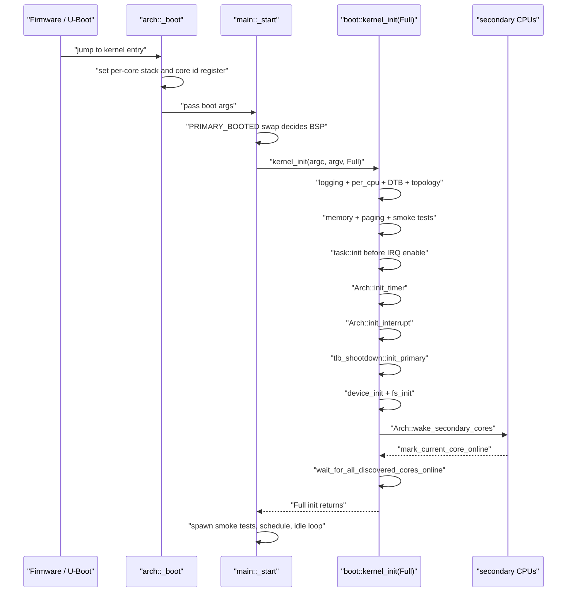
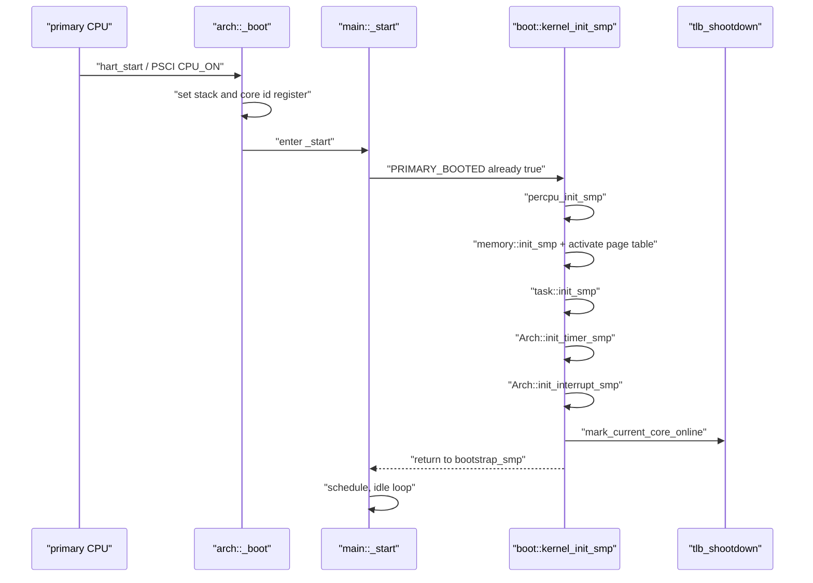

<!-- Copyright The SimpleKernel Contributors -->

# R4 架构启动与 SMP 上线时序

> 状态：当前实现说明，更新于 2026-05-09。
>
> 范围：`src/arch/`、`src/main.rs`、`src/boot.rs`、`src/cpu_topology.rs`、
> `src/tlb_shootdown.rs`。

本文记录 R4 架构层从固件入口到所有 CPU 可接收 IPI 的当前启动时序。历史阶段设计文档可能早于实现；
如果与本文或代码冲突，以当前代码为准。

## 平台契约

当前 SimpleKernel 不维护 logical CPU id 与硬件 CPU id 的 remap。平台必须满足：

- FDT `/cpus` 中的硬件 CPU id 组成 dense `0..core_count` 集合。
- RISC-V hart id 直接作为 core id。
- AArch64 当前只支持单 cluster，MPIDR Aff0 直接作为 core id，且 SGI TargetList 要求 `core_id < 16`。
- FDT discovered CPU 都必须完成 SMP online；任一从核启动失败或超时未上线，启动期 fail-fast。

这个取舍只固化当前支持平台的边界。是否引入 logical/hardware remap 仍属于后续 ADR 决策。

## 主核启动时序

关键顺序：

1. `task::init()` 必须早于 `Arch::init_interrupt()`，因为 timer IRQ exit 可能触发调度。
2. `tlb_shootdown::init_primary()` 必须在主核中断控制器可发送 IPI 后调用。
3. `device_init()` / `fs_init()` 仍在唤醒从核前执行，避免从核竞争早期设备和文件系统初始化。
4. `Arch::wake_secondary_cores()` 返回后，主核必须等待所有 discovered CPU 完成 online。

## 从核启动时序

从核只有在 `mark_current_core_online()` 之后才会被跨核 TLB shootdown 视为目标 CPU。这个 online
状态表示本核已经完成页表、任务、timer 和中断初始化，能够接收并处理 IPI。

## 失败路径

- FDT CPU 表为空、重复、非 dense 或超出 `MAX_CORE_COUNT`：`cpu_topology::init_from_fdt()` panic。
- 主核 core id 不在 FDT dense CPU 表内：启动期 panic。
- `hart_start` / PSCI `CPU_ON` 失败：架构 IPI 层 panic。
- 从核未在有限自旋内执行 `mark_current_core_online()`：`wait_for_all_discovered_cores_online()` panic，
  日志包含 expected、actual 和 missing mask。

## 验证

- `cargo xtask test --arch riscv64 --name arch-test --timeout 30`
  - 覆盖 dense CPU id 契约。
  - 覆盖 timekeeper 绑定 primary core。
  - 覆盖 Full 初始化返回时所有 discovered CPU 已 online。
- `cargo xtask test --arch riscv64 --name paging-test/tlb-shootdown --timeout 30`
  - 覆盖所有 online CPU 已进入 TLB shootdown 目标集合。
