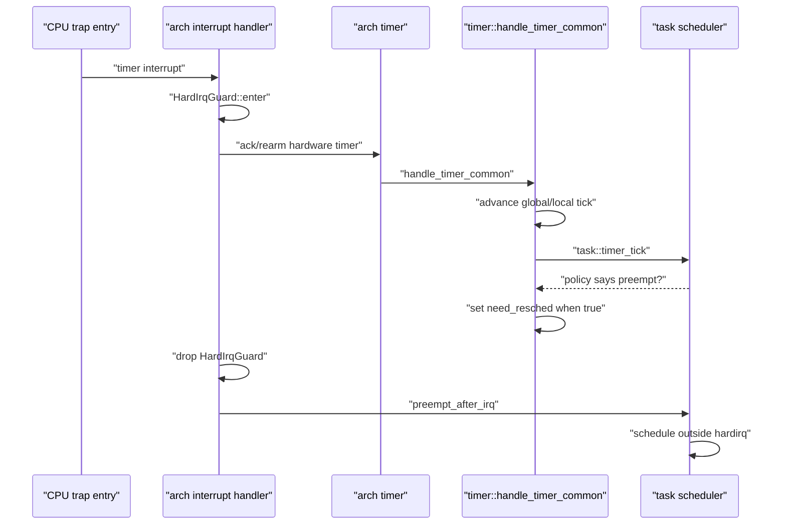
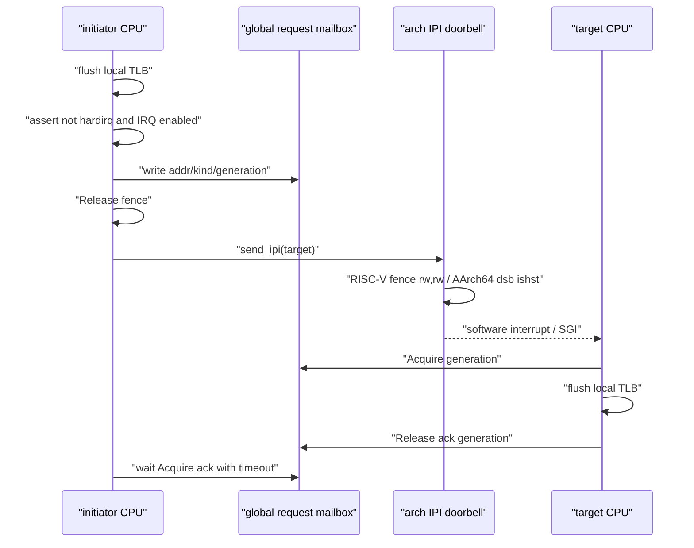

<!-- Copyright The SimpleKernel Contributors -->

# R4 中断、Timer 与 TLB Shootdown 流程

> 状态：当前实现说明，更新于 2026-05-09。
>
> 范围：`src/arch/{riscv64,aarch64}/interrupt.rs`、`src/arch/*/timer.rs`、
> `src/arch/*/ipi.rs`、`src/timer.rs`、`src/tlb_shootdown.rs`、`src/task/sched.rs`。

本文记录当前 R4 层已经落地的中断边界。RISC-V 浮点策略已由 ADR-017 收敛为 eager 保存恢复。
TLB shootdown 完整协议已由 ADR-018 收敛为方案 A：保留单 broadcast lock，补齐 timeout 和诊断；
timer absolute deadline / 长期漂移语义见 ADR-019，方案 B 已落地，方案 C 后续回看。

## Timer IRQ 与抢占边界

约束：

- 硬中断上下文内不直接调用 `schedule()`。
- timer 层只在 scheduler policy 返回需要抢占时设置当前核 `need_resched`。
- IRQ exit 抢占点在 `HardIrqGuard` 释放后执行，避免在 hardirq 计数非零时调度。
- `task::init()` 必须早于 IRQ enable，保证早到的 timer tick 有合法 scheduler 状态。

## TLB Shootdown 最小协议

当前实现按 ADR-018 方案 A 保留单 broadcast lock。已落地的硬化包括：

- 发起广播前禁止 hardirq 上下文。
- 存在远端目标时，发起广播前要求当前 CPU IRQ enabled，避免从已关中断的不可等待区域进入跨核等待。
- mailbox 发布后使用 release fence。
- RISC-V `send_ipi()` 前执行 `fence rw, rw`。
- AArch64 `ICC_SGI1R_EL1` 前执行 `dsb ishst`。
- 等待远端 ack 使用有限自旋上限，超时 panic 并打印发起核、目标 mask、缺失 ack mask、
  generation、request kind 和 request addr。

仍保留为后续演进的内容：

- 当运行期映射变更增多时，是否改为 per-CPU mailbox + sequence counter。
- 是否引入 stop-the-world rendezvous。
- 是否把页表写锁、调度锁、中断屏蔽之间的锁序进一步写成 token 或状态机。

## Timer Deadline 与漂移边界

当前 RISC-V / AArch64 均按 per-core absolute deadline 设置下一次 timer：

- RISC-V 每核保存 `NEXT_DEADLINE`，使用 SBI `set_timer(next_deadline)` 写 absolute deadline。
- AArch64 每核保存 `NEXT_DEADLINE`，使用 `CNTV_CVAL_EL0 = next_deadline` 写 absolute deadline。

handler 晚到时，公共 `timer::next_absolute_deadline()` 会把下一次硬件 deadline 推进到第一个严格晚于
当前硬件计数的位置。公共 tick 语义仍保持方案 B：每次 timer interrupt 只推进 1 个逻辑 tick，
不补记 missed ticks。missed tick 补记和 tickless one-shot 留到后续调度 / timeout 语义设计再回看。

## 中断分发职责

| 层 | 职责 |
|----|------|
| 汇编 trap entry | 保存/恢复 trap frame，跳转 Rust handler |
| 架构 interrupt 模块 | 识别 timer、IPI、外部中断，建立 `HardIrqGuard` |
| RISC-V FPU 上下文 | 每个 hart 启用 `sstatus.FS=Dirty`，trap 保存 `f0-f31/fcsr` |
| 架构 timer 模块 | ack/rearm 当前架构 timer，调用公共 timer 层 |
| 公共 timer 层 | 推进 tick、调用调度策略、设置 IRQ-exit 抢占标志 |
| TLB shootdown 模块 | 编码跨核请求、发送 IPI、等待远端 ack |
| task scheduler | 在 hardirq 外执行真实上下文切换 |

## 验证

- `cargo xtask test --arch riscv64 --name arch-test --timeout 30`
  - 覆盖 absolute deadline 推进契约、IRQ-exit 抢占请求只消费一次、RISC-V 浮点运算和 `fs0` 跨任务保存。
- `cargo xtask test --arch riscv64 --name paging-test/tlb-shootdown --timeout 30`
  - 覆盖 online CPU 集合参与 TLB shootdown 回归。
- `cargo xtask test --arch riscv64 --name paging-test/tlb-shootdown-timeout-panic --timeout 30`
  - 覆盖远端 ack 缺失时 fail-fast，而不是无限自旋。
- `cargo xtask test --arch riscv64 --name paging-test/tlb-remote-access --timeout 30`
  - 覆盖 CPU0 收紧页权限并等待 shootdown ack 后，CPU1 再写目标 VA 必须按新 RO 权限触发
    store page fault。
- `cargo xtask test --arch aarch64 --name paging-test/tlb-remote-access --timeout 30`
  - 覆盖同型 AArch64 路径：CPU1 再写目标 VA 必须触发写 data abort，并通过 `FAR_EL1/ELR_EL1`
    精确恢复。
- `cargo xtask check --arch riscv64` 和 `cargo xtask check --arch aarch64`
  - 覆盖两架构 absolute deadline 与 IPI barrier 代码可编译。
