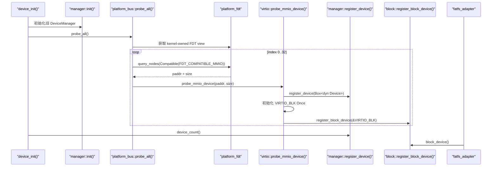
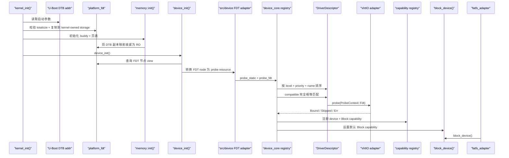

<!-- Copyright The SimpleKernel Contributors -->

# R6/D2 设备驱动描述符与 Probe Registry 设计说明

> **状态**：review 后重写，等待实现
>
> **范围**：R6 设备子系统 D2
>
> **依赖**：[设备子系统当前设计](device-subsystem-current.md)、
> [ADR-020](../adr/020-borrow-rdrive-patterns-local-device-framework.md)

## 设计结论

D2 的目标是把当前 `platform_bus` 中单一 VirtIO MMIO 探测逻辑，演进为
SimpleKernel 本地的 driver descriptor + probe registry 模型。D2 仍只覆盖启动期内建驱动，
不进入动态模块加载。

D2 不直接引入 `rdrive`。本设计只借鉴它的 descriptor、probe kind、probe level、priority 和
FDT compatible 匹配思路，并把 SimpleKernel 自己的 DTB 生命周期、MMIO、DMA、锁和错误处理边界
保留下来。

本轮确认后的核心边界：

- 将平台描述层收口为 `platform_fdt` crate：闭合 U-Boot 传入 DTB
  的生命周期，提供 kernel-owned FDT view 和平台描述查询。
- 新增 `device_core` crate：承载平台无关的 descriptor、probe 排序、诊断统计、`DeviceId` 和
  最小 capability registry 模型。
- D2c 新增 `device_block` crate：承载平台无关的 `BlockDevice` 能力接口和整扇区 I/O 校验。
- `src/device/` 保留为内核集成层：接入 `platform_fdt`、调用 `device_core`、适配 VirtIO/MMIO/DMA、
  保留迁移期兼容门面。
- D2 支持 `Static` / `Fdt` 两类 probe；PCIe、ACPI、自动链接段注册留到后续。
- FDT compatible 采用完全相等匹配；多个 FDT 节点拥有同一 compatible 是正常多设备实例。
- descriptor 侧同一 compatible 重复注册禁止；registry 初始化时诊断为错误。
- `ProbeRequirement` 只描述 descriptor 匹配后的 probe 失败策略，不表达“必须存在默认块设备”。
- 默认块设备是 capability 层的后置约束：Full + FS 路径要求至少一个 `Block` capability。
- VirtIO MMIO descriptor 必须区分 `Bound`、`Skipped` 和 `failed`，不能继续用
  `Result<(), DeviceError>` 承载三种语义。
- 每个 VirtIO block probe 成功都产生独立永久设备实例；`VIRTIO_BLK` 只保留为迁移期兼容入口。
- D2a-D2c 期间保持 `device_count()`、`virtio_blk()`、`block_device()`、`device-test` 和
  `fs-test` 可运行。
- D2 收口后，先清理公开 `virtio_blk()` 和旧 `DeviceManager` 公共路径，再进入更广义 D3。

## 设计目标

D2 要解决当前代码中的四个耦合点：

1. `platform_bus` 仍直接编排 VirtIO MMIO 探测，新增驱动会继续把 match 逻辑堆到总线代码里。
2. probe 顺序由代码位置和循环隐式决定，没有稳定的 descriptor 级排序语义。
3. probe 成功后的设备实例和上层能力分散在 `DeviceManager`、`virtio_blk()` 和
   `block_device()` 中，没有统一诊断入口。
4. FDT 解析虽然已经开始复制到 kernel-owned storage，但 crate 名称、查询入口和设备枚举模型
   仍停留在 parser wrapper 风格，尚未体现平台描述层边界。

D2 的目标是：

- 让驱动用 descriptor 声明自己支持的 probe kind 和 compatible。
- 让平台资源枚举通过参数传给 registry，而不是让 driver 自行扫描全局 FDT。
- 让 registry 统一负责 descriptor 排序、重复注册诊断、probe 结果汇总和 capability 选择。
- 让 probe 成功后的设备实例用 `DeviceId` 表达，并把上层可调用能力保存为 typed capability。
- 保持当前 VirtIO block 和 FAT 路径稳定，避免把框架迁移和文件系统迁移混到同一个 diff。

## 非目标

D2 明确不做以下工作：

- 不新增 `rdrive` Cargo 依赖。
- 不把 `rdif-*`、`rdrive::Device<T>` 或 `mmio-api` 暴露给上层模块。
- 不支持 PCIe probe。
- 不支持 ACPI probe。
- 不支持 `.driver.register*` 自动链接段注册。
- 不实现动态加载驱动模块。
- 不声明真机 non-coherent DMA、IOMMU、bounce buffer 或 DMA mask 策略已经闭环。
- 不在 D2a-D2c 中移除 `virtio_blk()` 兼容入口；该入口在 D2 收口清理切片中处理。
- 不实现完整多设备策略、设备依赖图、热插拔、卸载或 capability revoke。
- 不使用 `Any` / downcast 作为上层能力查询主路径。
- 不把固定 QEMU DTB 直接链接进 `.rodata` 作为通用方案；U-Boot 仍按标准方式传递独立 DTB。

## 当前真值面

当前设备初始化路径仍以 `platform_bus` 为中心：



当前兼容入口和 D2 要求如下：

| API / 路径 | 当前语义 | D2a-D2c 要求 | D2 收口后 |
|------------|----------|--------------|-----------|
| `device::device_init()` | 初始化 manager 后调用 platform bus | 入口不变，内部可切到 registry 编排 | 继续作为设备子系统初始化入口 |
| `manager::device_count()` | 读取旧 `Vec<Box<dyn Device>>` 长度 | 保持可用，保证 `device-test` 不断 | 删除公共旧路径或改为 registry-backed 门面 |
| `virtio::virtio_blk()` | 返回首个 VirtIO block 全局锁 | 迁移期保留，但不再作为所有权真值 | 删除公共入口或收窄为 `pub(crate)` |
| `block::block_device()` | 返回默认 `dyn BlockDevice` | 保持可用 | 保持稳定能力门面，由 registry 支撑 |
| `device-test` | 检查设备数、VirtIO block 和 sector 0 | 继续通过 | 改为 registry / `BlockDevice` 断言 |
| `fs-test` | 通过 `block_device()` 做 FAT I/O | 继续通过 | 继续通过 |

## 目标分层

D2 后的目标不是一个更大的 `src/device` 模块，而是清晰分层：

| 层 | 位置 | 职责 | 平台依赖 |
|----|------|------|----------|
| DTB 生命周期与 FDT view | `crates/platform_fdt` | 复制 U-Boot DTB、校验 totalsize、提供 selector 查询、节点 view 和 typed query | 不依赖具体设备驱动 |
| 设备核心模型 | `crates/device_core` | descriptor、probe kind、排序、重复诊断、统计、`DeviceId`、typed capability registry | 不依赖 FDT / MMIO / VirtIO |
| 块设备能力接口 | `crates/device_block` | `BlockDevice` trait、整扇区 I/O 校验、块设备错误类型 | 不依赖 VirtIO / FAT / registry |
| FDT probe 适配 | `src/device/` 内集成层，后续可独立 | 把 `platform_fdt` 节点 view 转换成 `device_core` 可 probe 的资源 | 依赖当前内核初始化顺序 |
| 具体驱动适配 | `src/device/virtio.rs` 等 | MMIO 映射、VirtIO transport、DMA HAL、block capability 创建 | 依赖内核 memory / dma |
| 上层门面 | `src/device/block.rs` 等 | `block_device()`、迁移期 `virtio_blk()` 兼容入口 | 依赖当前调用方 |

`device_core` 不应知道 DTB 地址来自 U-Boot，也不应依赖 `platform_fdt` 的全局 view 或
parser 类型。FDT 资源通过参数传入：

```text
platform_fdt.query_nodes(FdtSelector::Compatible(...))
  -> src/device fdt adapter
  -> device_core registry matching
  -> descriptor probe(ProbeContext::Fdt)
```

这与 `rdrive` 的差异是有意的。`rdrive` 把 core、FDT、ACPI、PCI backend 放在一个 crate 中；
SimpleKernel 为了审计清晰和教学性，把平台描述格式和设备核心模型拆开。

## DTB 生命周期

U-Boot/FIT 当前把 kernel 和 FDT 作为两个独立 image 传递。内核不能假设原始 DTB 位于内核代码段，
也不能假设原始 DTB 会在 frame allocator 启用后继续不被覆盖。

D2-0 采用 kernel-owned DTB 副本闭合生命周期，并把现有 FDT crate 收口为平台描述层：

1. 架构入口仍按现状取得 U-Boot/OpenSBI 传入的 DTB 地址。
2. `platform_fdt` 校验 DTB header，并读取 `totalsize`。
3. `early_init()` 把 DTB bytes 复制到内核自有、页对齐的固定 buffer 或等价 reserved storage。
4. 复制目标属于内核 data/reserved 范围，不进入 buddy allocator。
5. 内存分页初始化后，把该 storage 的映射权限收紧为 RO。
6. 后续所有 FDT 解析都基于 kernel-owned 副本，不再引用 U-Boot 原始地址。

该设计等价于把启动参数中的 DTB 从 bootloader-owned blob 转换为 kernel-owned platform data。
只有完成这一步后，registry 才允许长期保存来自 FDT 的 `node_path` / compatible 引用。

第一版 `platform_fdt` 可采用固定上限并 fail-fast：

```rust
pub const MAX_DTB_SIZE: usize = 256 * 1024;

pub struct PlatformFdt {
    bytes: &'static [u8],
}
```

如果实际 DTB 超过上限，`early_init()` 应 fail-fast，并打印原始 DTB 地址、`totalsize` 和上限。
后续若需要支持更大 DTB，可把 storage 改成 early boot allocator 或多个 reserved span。

## 目标运行路径



## 最小数据模型

### `device_core::DriverDescriptor`

`DriverDescriptor` 是驱动声明，不是设备实例。它只描述“这个驱动叫什么、从哪里匹配资源、
probe 顺序是什么、probe 函数是什么”。

草案形态：

```rust
pub struct DriverDescriptor {
    pub name: &'static str,
    pub probe_kind: ProbeKind,
    pub requirement: ProbeRequirement,
    pub level: ProbeLevel,
    pub priority: ProbePriority,
    pub probe: ProbeFn,
}

pub type ProbeFn = fn(ProbeContext<'_>) -> Result<ProbeOutcome, ProbeFailure>;
```

字段语义：

| 字段 | 语义 | D2 约束 |
|------|------|---------|
| `name` | 驱动稳定诊断名，例如 `virtio-mmio` | 全局唯一，重复 name 是 registry 初始化错误 |
| `probe_kind` | 资源来源 | D2 只支持 `Static` / `Fdt` |
| `requirement` | 匹配后 probe 失败是否阻止启动 | `Required` fail-fast，`Optional` 可诊断后跳过 |
| `level` | probe 阶段 | 粗粒度依赖排序 |
| `priority` | 同 level 内顺序 | 显式排序，避免注册顺序成为隐式 ABI |
| `probe` | 实际探测函数 | 只接收 `ProbeContext`，不自行扫描全局 FDT |

`device_core` 不依赖 `src/device::DeviceError`。具体驱动可以使用内核集成层自己的错误类型，
但进入 `device_core` 的 probe 边界前必须转换为 core-owned `ProbeFailure`。

### `ProbeKind`

```rust
pub enum ProbeKind {
    Static,
    Fdt {
        compatibles: &'static [&'static str],
    },
}
```

`device_core` 可以定义 `ProbeKind::Fdt` 的声明形态，但不直接解析 DTB。FDT 节点枚举由
`platform_fdt` 和 `src/device` adapter 提供。

### `ProbeRequirement`

```rust
pub enum ProbeRequirement {
    Required,
    Optional,
}
```

`ProbeRequirement` 只描述 descriptor 匹配后的 probe 失败策略，不改变平台输入校验规则。
FDT 缺失、FDT 解析失败、匹配节点 `reg` 非法仍始终 fail-fast。

默认块设备不是 descriptor 层 `Required` 的语义。Full + FS 路径对默认块设备的要求由
capability 层后置检查表达：完成 probe 后如果没有任何 `DeviceCapability::Block`，则 fail-fast。

### `ProbeLevel`

```rust
#[derive(Clone, Copy, PartialEq, Eq, PartialOrd, Ord)]
pub enum ProbeLevel {
    Core,
    Bus,
    Device,
    Late,
}
```

| Level | 含义 | D2 使用情况 |
|-------|------|-------------|
| `Core` | 不依赖总线枚举的基础设施 | D2 暂不需要具体驱动 |
| `Bus` | 提供枚举能力的总线或桥 | D2 可保留给 platform bus facade |
| `Device` | 普通设备驱动 | VirtIO MMIO block 使用此 level |
| `Late` | 依赖已有 capability 的后置初始化 | D2 保留但不使用 |

`Late` 的典型后续场景包括分区块设备、root block 选择、devfs 设备节点发布、聚合设备、
虚拟设备或 class-level 后处理。`Late` 不用于直接匹配 FDT 节点；真实硬件资源匹配仍在
`Device` 或更早阶段完成。

### `ProbePriority`

```rust
#[derive(Clone, Copy, PartialEq, Eq, PartialOrd, Ord)]
pub struct ProbePriority(pub i16);
```

建议约定：

| 范围 | 含义 |
|------|------|
| `-1000..=-1` | 需要先运行的内建/平台驱动 |
| `0` | 默认优先级 |
| `1..=1000` | 明确延后运行的驱动 |

descriptor 的稳定排序规则：

1. 按 `ProbeLevel` 升序。
2. 按 `ProbePriority` 升序。
3. 按 `name` 字典序作为 tie-breaker。

排序结果同时决定 probe 顺序和默认 `Block` capability 的选择顺序。

## FDT 匹配语义

D2 registry 以 FDT 节点为匹配单位。驱动不再自行调用
`find_compatible_node_nth("...", index)`；`platform_fdt` 也不保留这类旧兼容包装。

FDT `compatible` 属性是字符串列表，通常从具体到通用，例如：

```text
compatible = "vendor,specific-device", "virtio,mmio";
```

D2 规则：

- descriptor 通过 `compatibles: &'static [&'static str]` 声明可匹配字符串。
- FDT 节点任一 compatible 与 descriptor 任一字符串完全相等，即视为候选匹配。
- 不做 substring、前缀、glob 或大小写不敏感匹配。
- 一个 FDT 节点被某个 descriptor 成功绑定后，后续 descriptor 不再 probe 该节点。
- probe 返回 `Skipped` 时，该节点保持 unbound，允许后续 descriptor 尝试。
- descriptor 侧同一 compatible 重复声明是 registry 初始化错误。
- 多个 FDT 节点拥有同一 compatible 是正常多设备实例。

`platform_fdt` 对外提供统一查询入口，selector 同时支持固定 path 和 compatible 枚举：

```rust
pub enum FdtSelector<'a> {
    Path(&'a str),
    Compatible(&'a str),
}

pub fn query_nodes(&self, selector: FdtSelector<'_>) -> Result<FdtNodeIter<'_>, FdtError>;
```

Path 查询用于 `/cpus`、`/reserved-memory` 等固定平台配置节点；设备发现仍使用 FDT
标准的 compatible 匹配语义。compatible 查询为空不是错误；若某个 matched node 的必需属性
非法，必须返回结构化错误，不能伪装成 `NodeNotFound`。

`platform_fdt` 应提供本地 borrowed view，避免把第三方 FDT parser 类型直接扩散到 `device_core`：

```rust
pub struct FdtNodeView<'a> {
    pub id: FdtNodeId,
    pub path: &'a str,
    pub compatibles: FdtCompatibleList<'a>,
    pub reg: Option<FdtReg>,
}

pub struct FdtReg {
    pub paddr: PhysAddr,
    pub size: usize,
}
```

D2 只要求 VirtIO MMIO 当前需要的 `reg`。中断号、DMA mask、phandle、parent bus 等属性留给后续。

`device_core` 不直接依赖 `platform_fdt` 的内部类型。`src/device` 的 FDT adapter 负责把
`platform_fdt::FdtNodeView<'_>` 转换为 `device_core` 拥有的最小 probe value，例如 opaque
`FdtNodeId`、`node_path`、`matched_compatible` 和 `FdtReg`。同名类型如果同时存在，应通过模块路径
区分，不能让 `device_core` 反向依赖 `platform_fdt`。

## ProbeContext 和 ProbeOutcome

probe 函数只接收 registry 传入的最小上下文。

```rust
pub enum ProbeContext<'a> {
    Static,
    Fdt(FdtProbeContext<'a>),
}

pub struct FdtProbeContext<'a> {
    pub node_id: FdtNodeId,
    pub node_path: &'a str,
    pub matched_compatible: &'a str,
    pub reg: FdtReg,
}

pub enum ProbeOutcome {
    Bound {
        device_id: DeviceId,
    },
    Skipped {
        reason: ProbeSkipReason,
    },
}
```

`Bound` 表示该 descriptor 已经绑定该资源，并完成设备或能力注册。`Skipped` 表示资源可匹配，
但该实例不应由该 descriptor 绑定。

由于 D2-0 已经把 DTB 复制到 kernel-owned RO storage，`platform_fdt` 可以安全返回 borrowed
node view；但 `device_core` 仍不直接保存这些 view。跨入 registry 前由 `src/device` adapter
转换为最小 probe value，长期诊断所需字段应在 adapter 边界明确拷贝或转为平台无关值。

### ProbeFailure

`ProbeFailure` 是 `device_core` 的 probe 失败类型，用于跨 descriptor / registry 统一诊断。
它不能依赖 `src/device::DeviceError`，也不能携带 `Box<dyn Error>` 这类会把内核集成层类型反向拖入
核心 crate 的对象。

草案形态：

```rust
pub struct ProbeFailure {
    pub kind: ProbeFailureKind,
    pub detail: &'static str,
}

pub enum ProbeFailureKind {
    InvalidResource,
    TransportInitFailed,
    DeviceInitFailed,
    IoFailed,
    Unsupported,
}
```

转换边界：

- `src/device` 和具体驱动可以继续使用 `DeviceError` 或更细的本地错误。
- descriptor adapter 负责把本地错误转换成 `ProbeFailure`，并在日志中保留原始错误的 Debug 信息。
- `device_core` 负责把 descriptor name、probe context、`ProbeFailure` 聚合成 fail-fast 或 skipped 诊断。
- 如果后续需要更丰富的错误上下文，应先扩展 `ProbeFailureKind` 或增加小型枚举，不用 `Any` / downcast。

## VirtIO Probe 语义

当前 `virtio::probe_mmio_device(paddr, size) -> Result<(), DeviceError>` 无法区分“成功绑定块设备”
和“识别到非 block VirtIO 后跳过”。D2b 必须新增 typed adapter API，旧函数只作为迁移期兼容包装。

草案形态：

```rust
pub enum VirtioMmioProbeResult {
    Block {
        device: &'static dyn device_block::BlockDevice,
    },
    Skipped {
        reason: ProbeSkipReason,
    },
}

pub fn probe_mmio_block(
    context: FdtProbeContext<'_>,
) -> Result<VirtioMmioProbeResult, DeviceError>;
```

迁移期规则：

- registry path 使用 typed result，并把 `Block` 转成 `DeviceCapability::Block`。
- 旧 `probe_mmio_device()` 可调用新 adapter，但只用于保持 D2a-D2c 兼容入口。
- 非 block VirtIO MMIO 设备返回 `Skipped`，不算 required probe failure。
- VirtIO transport 初始化失败、block 初始化失败、sector 0 读测试失败等仍返回 `Err(DeviceError)`。

## 失败语义

D2 把“平台输入错误”、“不支持实例”、“probe 失败”和“required capability 缺失”分开处理。

| 分类 | 示例 | D2 语义 |
|------|------|---------|
| 平台契约破坏 | DTB 缺失、DTB 超出上限、FDT 解析失败、匹配节点 `reg` 非法 | fail-fast |
| 不支持该实例 | VirtIO MMIO 设备类型不是 block | `Skipped` |
| optional descriptor probe 失败 | 可选设备初始化失败 | 记录诊断后跳过 |
| required descriptor probe 失败 | descriptor 已匹配但初始化失败 | fail-fast |
| required capability 缺失 | Full + FS 路径没有任何 `Block` capability | probe 完成后 fail-fast |
| 多个块设备能力 | 多个 VirtIO block 都成功 | 保存全部，默认选择第一个 |

诊断要求：

- `Required` 失败时，panic/error 信息必须包含 descriptor name、node path、matched compatible、
  paddr、size 和原始错误。
- `Optional` 失败时，日志必须包含相同上下文，且 registry 统计为 skipped/failed。
- required `Block` capability 缺失时，日志必须列出已匹配、bound、skipped、failed 的相关 descriptor
  和 FDT 节点。
- registry 启动摘要应记录每个 descriptor 的 matched / bound / skipped / failed 计数。
- 多个 `Block` capability 存在时，日志必须记录默认 `DeviceId` / 名称 / 来源，并列出其他候选。

## Registry 和 Capability

D2 registry 最少保存三类信息：

1. 静态 descriptor 列表和重复注册诊断。
2. probe 过程中的节点绑定状态和诊断统计。
3. probe 成功后产生的设备实例与 typed capability。

建议模型：

```rust
#[derive(Clone, Copy, PartialEq, Eq)]
pub struct DeviceId(u32);

pub struct RegisteredDevice {
    pub id: DeviceId,
    pub name: &'static str,
    pub device_type: DeviceType,
    pub source: DeviceSource,
}

pub enum DeviceSource {
    Static,
    Fdt {
        node_id: FdtNodeId,
        node_path: &'static str,
        matched_compatible: &'static str,
        paddr: PhysAddr,
        size: usize,
    },
}

pub enum DeviceCapability {
    Block(&'static dyn device_block::BlockDevice),
}
```

职责分离：

- `DriverDescriptor` 是驱动声明。
- `RegisteredDevice` 是 probe 成功后的设备实例。
- `DeviceCapability` 是该设备实例暴露给上层的能力。
- capability 通过 `DeviceId` 关联到设备实例，不直接塞进 descriptor。

`DeviceType`、`FdtNodeId`、`FdtReg`、`DeviceSource` 这类 registry 诊断所需值类型由
`device_core` 自己定义，或由 `src/device` adapter 转换成 `device_core` 拥有的等价值类型。
它们不能直接复用 `src/device::DeviceType` 或 `platform_fdt` 内部节点类型，否则 `device_core` 会失去
平台无关边界。

D2 首批只实现 `DeviceCapability::Block`。该能力依赖 D2c 新增的 `device_block` crate，而不是
`src/device/block.rs` 中的本地门面。未来需要网络、串口、输入等设备时，再显式追加 enum 变体。
第一版不使用 `Any` / downcast。

默认块设备选择规则：

1. registry 保存所有 `DeviceCapability::Block`。
2. descriptor/probe 顺序中第一个成功注册的 `Block` capability 成为默认 `block_device()`。
3. `block_device()` 继续是 FAT 和上层模块的稳定入口。
4. Full + FS 路径要求至少存在一个默认 `Block` capability；缺失时 fail-fast。
5. `virtio_blk()` 只在 D2a-D2c 迁移期保留，D2 收口后清理。

## 多 VirtIO Block 实例

当前 `VIRTIO_BLK: Once<VirtIOBlockLock>` 只能表达一个块设备。D2c 后它不能继续作为所有权真值。

D2c 规则：

- 每个 VirtIO block probe 成功都分配一个永久设备实例。
- 该实例由 registry 保存，并通过 `DeviceId` 关联 `DeviceCapability::Block`。
- D2 不实现 unload、revoke 或热插拔释放，boot device 可以永久持有。
- `virtio_blk()` 迁移期只返回默认 VirtIO block，作为旧测试和旧调用点的兼容门面。

可接受的第一版实现包括 `Box::leak` 或 registry-owned 永久 storage。关键约束是：
`block_device() -> Option<&'static dyn device_block::BlockDevice>` 的兼容语义必须保持，且后续多个块设备不能被
`VIRTIO_BLK.call_once()` 静默吞掉。

## 实现切片

D2 拆成四个实现切片和一个收口清理切片。每个切片都必须保持当前兼容入口可用。

### D2-0：`platform_fdt` 与 DTB 生命周期闭合

目标：

- 使用 `crates/platform_fdt` 作为平台描述层 crate，不保留旧 crate 名或兼容 re-export。
- 在 `early_init()` 中校验 U-Boot 传入 DTB，并复制到 kernel-owned storage。
- 后续 FDT 解析只基于 kernel-owned 副本。
- 分页初始化后将 DTB 副本所在页映射为 RO。
- 提供 `FdtSelector::{Path, Compatible}` 统一查询入口和 borrowed `FdtNodeView`。
- 调用方迁移到新 API，不保留 `find_compatible_node_nth()` 等旧兼容包装。

验证重点：

- `memory-test` 中已有 FDT 测试继续通过。
- `device-test` 和 `fs-test` 继续通过。
- DTB 超出上限时 fail-fast，错误信息包含原始地址、`totalsize` 和上限。

### D2a：`device_core` descriptor / registry 纯模型

目标：

- 新增 `crates/device_core`。
- 定义 `DriverDescriptor`、`ProbeKind`、`ProbeRequirement`、`ProbeLevel`、`ProbePriority`、
  `ProbeOutcome`、`ProbeFailure`、`DeviceId`、`DeviceType`、`DeviceSource`、`FdtNodeId`、
  `FdtReg` 和基础诊断统计。
- `device_core` 不依赖 `src/device::DeviceError`、`platform_fdt`、VirtIO、MMIO 或 FAT。
- 不迁移 QEMU 启动路径。
- 不改变 `platform_bus::probe_all()` 真实行为。
- 不改变 `virtio.rs`、`block_device()` 或 `fatfs_adapter`。

首批 descriptor 仍可由 `src/device` 手写静态 slice 提供：

```rust
static BUILTIN_DRIVERS: &[DriverDescriptor] = &[VIRTIO_MMIO_DRIVER];
```

测试遵循项目已有习惯：

- `device_core` 作为纯逻辑 crate，可使用 host `cargo test` 覆盖排序、重复注册和错误分类。
- kernel 集成路径仍通过 `tests/device-test` / QEMU standalone test 验证。
- 不为真实 FDT parser、MMIO、DMA、VirtIO、interrupt、per-CPU 或 `device_init()` 增加 host mock。
- 不用 `#[cfg(test)]` 改变真实 probe path。

### D2b：platform bus 迁移到 descriptor-driven Static / FDT

目标：

- `platform_bus` 从集中式 VirtIO MMIO match 迁移为 registry 编排。
- `device_init()` 入口保持不变。
- `src/device` 通过 `platform_fdt` 枚举 FDT 节点，并把资源通过参数传给 `device_core`。
- 新增 VirtIO MMIO descriptor adapter，把 `ProbeContext::Fdt` 转成现有 VirtIO MMIO 初始化参数。
- 新增 typed VirtIO probe result；旧 `virtio::probe_mmio_device(paddr, size)` 保留为兼容包装。

迁移前：

```text
for node in platform_fdt.query_nodes(FdtSelector::Compatible(FDT_COMPATIBLE_MMIO)):
    let reg = node.reg_required()
    virtio::probe_mmio_device(reg.paddr, reg.size)
```

迁移后：

```text
registry.probe_static(BUILTIN_DRIVERS)
registry.probe_fdt(BUILTIN_DRIVERS, platform_fdt.query_nodes(...))
```

D2b 验证重点：

- `device-test` 仍能通过 `device_count()`、`virtio_blk()` 和 `block_device()` 读取 sector 0。
- `fs-test` 仍能通过默认 `block_device()` 使用 FAT 路径。
- DTB 缺失、FDT 解析失败、匹配节点 `reg` 非法仍 fail-fast。
- 多个同 compatible FDT 节点可以逐个 probe。
- 非 block VirtIO MMIO 节点记录为 `Skipped`。
- 不引入 PCIe、ACPI 或自动链接段注册。

### D2c：typed capability registry 和默认 Block 选择

目标：

- 新增 `crates/device_block`，把平台无关的 `BlockDevice` trait、整扇区校验和块设备错误类型从
  `src/device/block.rs` 中抽出。
- `src/device/block.rs` 改为兼容门面，继续提供 `block_device()`，并负责把旧调用方和
  `device_block` trait 连接起来。
- `device_core::DeviceCapability::Block` 依赖 `device_block::BlockDevice`，不依赖
  `src/device/block.rs`。
- VirtIO block probe 成功后注册 `RegisteredDevice`。
- 同一设备注册 `DeviceCapability::Block`。
- registry 保存所有 `Block` capability。
- `block_device()` 的默认选择接入 registry 规则。
- probe 完成后检查 required default `Block` capability。
- `virtio_blk()` 继续作为迁移期兼容入口。

成功路径：

```text
VirtIO block probe 成功
  -> 创建永久 VirtIO block 实例
  -> registry.register_device(...)
  -> registry.register_capability(device_id, DeviceCapability::Block(instance))
  -> 若这是第一个成功 Block capability，则作为默认 block_device()
  -> 兼容期继续让 virtio_blk() 返回默认 VirtIO block
```

D2c 完成后必须保持：

- `manager::device_count() > 0`。
- `virtio::virtio_blk().is_some()`。
- `block::block_device().is_some()`。
- `device-test` 能读取 sector 0。
- `fs-test` 能继续通过 `fatfs_adapter` 使用默认块设备。

### D2 收口清理

D2c 通过后、进入 D3 前，先做清理切片：

- `device-test` 不再断言 `virtio_blk()` 存在，改为通过 registry 或 `block_device()` 验证默认块设备。
- `virtio::virtio_blk()` 删除公共入口，或收窄为 `pub(crate)`。
- 旧 `manager::device_count()` 公共路径删除，或改为 registry-backed 门面。
- `Vec<Box<dyn Device>>` 不再作为设备枚举真值面。
- `device-subsystem-current.md` 同步更新为“旧入口已清理”。

## 与 rdrive 的关系

`rdrive` 的相关做法：

- `Platform::Fdt { addr }` 初始化 FDT backend。
- `DriverRegister` 包含 `name`、`level`、`priority` 和 `probe_kinds`。
- `ProbeKind::Fdt { compatibles, on_probe }` 直接把 FDT backend 和 driver register 放在一个 crate 中。
- probe 时 rdrive 遍历全局 FDT system，匹配 compatible 后把 `FdtInfo<'_>` 和 `PlatformDevice`
  传给 driver。

SimpleKernel 的取舍：

- 借鉴 descriptor、probe kind、priority 和 compatible 匹配。
- 不复用 rdrive 的 `Device<T>`、`rdif-*`、`spin::Mutex` / `RwLock`、`mmio-api` 或自动链接段。
- 不把 FDT backend 和设备核心模型强绑定在一个 crate 中。
- 用 `platform_fdt` 显式闭合 U-Boot DTB 生命周期，再把 FDT 节点作为参数传给 `device_core`。

## 测试策略

现有测试模型仍分两层：

- 纯逻辑 workspace crate 用 host `cargo test`。
- 内核集成和硬件路径用独立 QEMU system test。

D2 测试边界：

| 可用 host test 覆盖 | 必须 QEMU 覆盖 |
|---------------------|----------------|
| `device_core` descriptor 排序 | `device_init()` 启动闭环 |
| 重复 descriptor name / compatible 诊断 | 真实 FDT parser + DTB 副本 |
| `Required` / `Optional` 错误分类 | MMIO 映射 |
| probe 统计聚合 | VirtIO transport |
| 默认 Block 选择的纯排序规则 | DMA backend |
| `platform_fdt` 的纯 bytes fixture 解析 | `block_device()` + FAT I/O |
| `device_block` 整扇区 I/O 校验 | VirtIO block sector 0 读写 |

文档阶段验证：

```bash
git diff --check
```

实现阶段至少运行：

```bash
devcontainer exec --workspace-folder . cargo fmt --all -- --check
devcontainer exec --workspace-folder . cargo test -p device_core
devcontainer exec --workspace-folder . cargo test -p platform_fdt
devcontainer exec --workspace-folder . cargo test -p device_block
devcontainer exec --workspace-folder . cargo xtask check --arch riscv64
devcontainer exec --workspace-folder . cargo xtask check --arch aarch64
devcontainer exec --workspace-folder . cargo xtask test --arch riscv64 --name device-test --timeout 30
devcontainer exec --workspace-folder . cargo xtask test --arch riscv64 --name fs-test --timeout 30
```

QEMU 命令必须设置 30 秒超时，并在超时后清理残留 `qemu-system` 进程。

## Review 检查清单

- D2 是否仍只覆盖 Static / FDT。
- PCIe、ACPI、自动链接段注册是否明确留到后续。
- `platform_fdt` 是否闭合 U-Boot DTB 生命周期，并避免继续缓存 bootloader-owned DTB 引用。
- DTB 副本是否最终映射为 RO。
- `device_core` 是否保持平台无关，不依赖 FDT / MMIO / VirtIO。
- `device_core` 是否不依赖 `src/device::DeviceError`，probe 边界是否使用 core-owned `ProbeFailure`。
- `device_core` 是否不直接依赖 `platform_fdt` 内部类型，FDT adapter 是否完成 value 转换。
- `device_block` 是否承载平台无关 `BlockDevice` trait，`src/device/block.rs` 是否只是兼容门面。
- `DriverDescriptor` 是否只表达驱动声明，不混入设备实例。
- FDT compatible 是否采用完全相等匹配。
- 多个同 compatible FDT 节点是否作为正常多设备实例处理。
- descriptor 侧重复 compatible 是否在 registry 初始化阶段诊断。
- probe 顺序是否由 `ProbeLevel` + `ProbePriority` + `name` 稳定决定。
- `ProbeRequirement` 是否只影响已匹配 descriptor 的 probe 失败语义。
- 默认块设备是否由 capability 层后置检查，而不是误用 descriptor `Required` 表达。
- 平台输入错误是否仍 fail-fast。
- VirtIO adapter 是否明确区分 `Bound` / `Skipped` / `Err`。
- registry 是否保存所有 `Block` capability，而不是继续被 `VIRTIO_BLK` 限制为一个实例。
- `block_device()` 默认选择是否按 descriptor/probe 顺序取第一个成功 `Block`。
- D2a-D2c 期间 `device_count()`、`virtio_blk()`、`block_device()` 是否都有兼容路径。
- D2 收口后是否先清理公开 `virtio_blk()` 和旧 `DeviceManager` 公共路径。
- 测试是否遵循项目既有边界：纯逻辑 crate host test，真实平台路径 QEMU system test。
