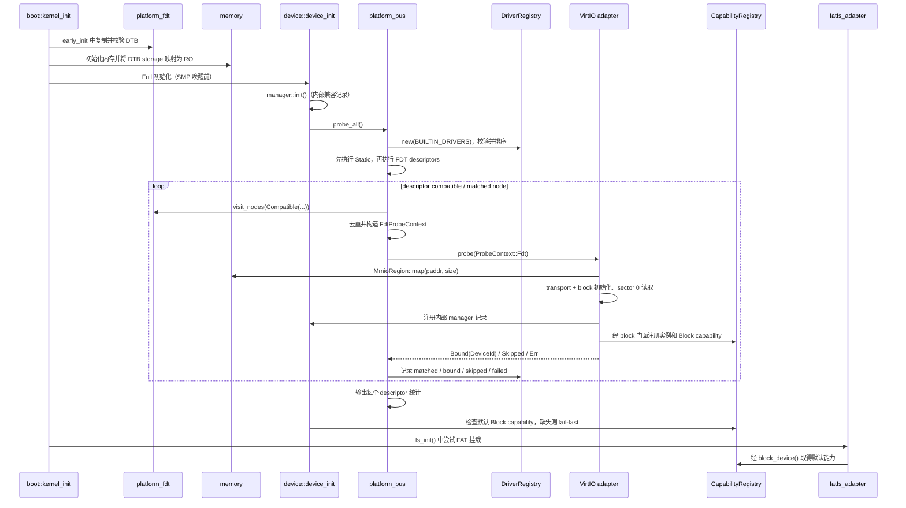

<!-- Copyright The SimpleKernel Contributors -->

# 设备子系统当前设计

> 实现核对：2026-09-22，基线 `e45053ab`。本文承接 D2 的有效契约，当前工作与下一步
> 见[审计进度](../audit/audit-progress.md)，R6 交付物见[Roadmap](../audit/review-roadmap.md)。
> 旧 D2 文档由 `e45053ab` 删除；追溯使用
> `git show e45053ab^:docs/design/device-d2-driver-descriptor-probe.md`。
> 历史迁移步骤不再作为实现要求。框架取舍见
> [ADR-020](../adr/020-borrow-rdrive-patterns-local-device-framework.md)，早期背景见
> [P6 设计](P6-设备框架与驱动.md)。

## 当前实现与责任边界

D2 已实现启动期内建 descriptor、Static / FDT probe 和最小 typed capability registry。
SimpleKernel 借鉴 `rdrive` 的注册和匹配思路，保留本地边界，不直接引入其核心框架。
D2 的实现完成不表示 VFS、FD、FAT 或整个 R6 审计关闭。

| 层 | 当前代码 | 职责 |
|----|----------|------|
| 平台描述 | `crates/platform_fdt/src/` | kernel-owned DTB、selector、borrowed view、稳定节点身份和结构化错误 |
| 核心模型 | `crates/device_core/src/descriptor.rs`、`registry/`、`capability.rs` | 驱动声明、排序与校验、probe 统计、设备实例、Block 能力和错误 |
| 总线集成 | `src/device/platform_bus.rs`、`platform_bus/` | 枚举 FDT、构造 probe 参数、维护本次扫描的绑定集合、日志及失败策略 |
| 驱动适配 | `src/device/virtio/mmio.rs`、`virtio/block_device.rs`、`hal.rs` | MMIO transport、永久块设备实例、VirtIO I/O 与 DMA 适配 |
| 上层门面 | `src/device/mod.rs`、`block.rs` | 初始化、registry 设备计数、默认块设备查询 |
| 文件系统适配 | `src/fs/fatfs_adapter.rs` | 通过 `BlockDevice` 门面做扇区 I/O，不依赖 VirtIO 具体类型 |

`device_core` 可依赖 `platform_fdt` 的公开值类型，但不调用 `platform_fdt::get()`、
不初始化 DTB storage、不扫描全局 FDT，也不依赖 VirtIO、MMIO、DMA、FAT 或
`src/device::DeviceError`。全局 capability registry 的同步在内核集成层完成。

`DriverDescriptor` 是驱动声明；`RegisteredDevice` 是实例；`DeviceCapability` 是实例提供的
能力，通过 `DeviceId` 关联。`DeviceSource::Fdt` 直接复用 `FdtProbeContext`，不再复制一套同义字段。

## 启动与运行路径

图中注册步骤只发生在成功 block probe 分支。空 slot 或不支持的设备返回 `Skipped`，
实际错误按下文策略处理；FAT 挂载失败可能返回 `false`，不等于 Full 初始化失败。

## DTB 生命周期与节点身份

- 正常启动校验 bootloader DTB header / totalsize，并复制到页对齐的 kernel-owned storage；
  分页初始化后收紧为 RO。后续解析不再依赖 bootloader 原始 blob 的存活。
- 容量由 `crates/config/src/lib.rs` 的 `MAX_DTB_SIZE` 等常量定义，超限显式报错；
  `PlatformFdt::from_static()` 只用于满足其 unsafe 生命周期前提的静态镜像或 fixture。
- `FdtNodeId` 是同一 DTB view 内的全树 DFS 序号；Path 和 Compatible 查询命中同一节点时
  id 相同，不是查询结果局部序号，也不是跨 DTB / 跨启动的硬件全局身份。
- `query_nodes()` 是有固定容量的小结果集快照；设备发现使用 `visit_nodes()` 流式枚举，
  避免把 QEMU VirtIO MMIO 节点数量限制为结果数组容量。流式枚举不取消 registry 的固定容量。
- `FdtSelector::{Path, Compatible}` 查询返回 borrowed `FdtNodeView`；设备集成层转换为
  按值 `FdtProbeContext`，仅携带 node id、DTB-backed `'static` 节点名 / unit address、
  matched compatible 和第一个 `FdtReg`。registry 不保存 borrowed node view / node list。
- 查询层返回 `FdtError`，compatible 无匹配是空结果；匹配节点的必需属性非法必须返回
  错误，不能伪装成无匹配。启动集成层据此 fail-fast。

## Descriptor、匹配与排序

- 当前内建清单是静态 `BUILTIN_DRIVERS`，只有 `virtio-mmio`：`Required`、`Device`、
  `ProbePriority::DEFAULT`。模型支持 Static，但当前没有内建 Static driver。
- `DriverRegistry::new()` 校验数量上限、驱动名唯一性和不同 descriptor 之间的 compatible
  冲突；按 `ProbeLevel`、`ProbePriority`、name 字典序升序排序。
- **实际执行还分两遍**：`platform_bus::probe_all()` 先执行全部 Static，再执行 FDT；
  每遍遵循上述排序，FDT 内按 descriptor compatible 列表及节点遍历顺序处理。
  不能据排序模型声称 Static/FDT 混合执行时具有全局 level 顺序或已支持真正的 Late 阶段。
- compatible 必须完全相等，不做 substring / 前缀 / glob 匹配。多个节点具有同一 compatible
  是正常多实例；compatible 不是设备身份。
- 同一 descriptor 的多个 compatible 命中同一节点时，只在首个匹配项处理；成功 `Bound`
  后记录稳定 node id，后续 descriptor 不再 probe 该节点。`Skipped` 或可继续的失败不标记 bound。
- `ProbeLevel::Late` 目前仅为枚举值，没有内建 Late driver；分区、root 选择或能力依赖
  的后置调度仍需范围与时序设计，不能当成已存在的运行阶段。

## Probe 结果、失败与诊断

| 情况 | 当前语义 |
|------|----------|
| 平台 FDT 缺失、查询失败、匹配节点必需 `reg` 非法 | 集成层 fail-fast，`Optional` 不能放宽平台契约 |
| 空 VirtIO slot（device id 0） | `Skipped(NotApplicable)` |
| 非 block / 暂不支持的 VirtIO 类型 | `Skipped(UnsupportedDevice)` |
| 成功完成设备及能力注册 | `Bound { device_id }`，不是仅识别到资源 |
| transport / block 初始化或 sector 0 读取失败 | adapter 转为 `ProbeFailure`；`Required` panic，`Optional` 记日志后继续 |
| probe 结束没有默认 Block | `device_init()` 后置检查 fail-fast；不是 descriptor `Required` 的含义 |
| 多个 Block 注册成功 | 全部保存在固定容量 registry 中，默认取第一个 |

`ProbeRequirement` 只控制 probe 返回失败时的策略，不保证某 descriptor 必须匹配到设备，
也不把 `Skipped` 变成失败。失败在统计中增加 `failed`，不冒充 `bound` 或 `skipped`。

错误边界由 adapter 显式转换：本地 `DeviceError` → core-owned `ProbeFailure`；
具体 block I/O → `BlockError`。原始错误和 FDT 上下文先在集成层记录，
不向 core 反向引入 `Box<dyn Error>` / `Any` / downcast。
日志应保留 driver、node id、name/unit address、matched compatible、reg 地址/大小和错误来源。
当前总线输出逐次 probe 日志及每 descriptor 统计，block 门面输出默认/额外实例 id 和名称。
旧 D2 文档要求的“默认设备与全部候选来源完整汇总”不据此认定全部验收完成；
尤其 `Skipped` 为 debug 日志，默认 Block 缺失时不会重新枚举全部节点诊断。

## Block 能力、所有权与公开入口

- `device_core::BlockDevice: Send + Sync` 提供 sector size/count、饱和乘法字节容量，以及
  单个完整扇区 read/write。`validate_sector_io()` 校验缓冲长度和扇区范围；错误类型为
  `BlockError` / `BlockResult`，由实现返回，上层决定如何转换。
- 每个成功 VirtIO block probe 通过 `Box::leak` 创建永久 `VirtIOBlockDevice`，其内部持有
  项目 `SpinLock<VirtIOBlk<...>>`。当前没有 unload、revoke、热插拔释放或通用依赖图。
- `CapabilityRegistry` 保存实例和 `DeviceCapability::Block`。默认值来自本次启动实际
  probe / 注册顺序中的第一个 Block，不按磁盘身份或分区选择；没有 root 选择策略。
- `block_device()` 返回 `Option<&'static dyn BlockDevice>`；`default_block_device_id()` 查询
  默认身份；`device::device_count()` 返回 registry 实例数。registry 容量取自 `config`，
  超限返回 `RegistryError`，启动集成层按失败策略处理，不承诺无限设备或事务式回滚。
- `DeviceManager` 只保留 crate 内部兼容记录，不作为公开计数真值；公开 `virtio_blk()`
  和旧 manager 公开路径已删除。`virtio::probe_mmio_device()` 与 `probe_mmio_block()`
  仍公开，因此 D2 清理不能等同于完整的公共 API 收窄。
- 上层依赖本地门面。MMIO 仍经 `memory::MmioRegion`，DMA 仍经 `crates/dma` 的
  QEMU identity backend；不引入第三方锁或另一套全局 MMIO 入口绕过这些边界。

## 后续候选与非目标

D0.5 的基线强化、D1 的 Block 门面及 D2 的注册模型属于已落地历史，具体记录见
[审计历史](../audit/2026-09-22-audit-history.md)。不再保留要求恢复 `virtio_blk()` 的迁移步骤。

D3 的 root/default block 选择、分区块设备、Late 后置初始化、多能力查询均是**待确认候选**。
历史 D3a/D3b 推荐顺序不构成已接受计划。最小目标、失败/回退语义、依赖顺序与验收测试
须先确认；优先级以审计进度为准。

动态注册、PCIe/ACPI、自动链接段注册、驱动模块 ABI、ELF 装载和卸载均未实现，
也不纳入已确认 D3 范围。历史 D4–D7 编号只是演进讨论，不是交付承诺。
若重启动态加载设计，需要单独处理受信任 SAS 代码边界、稳定 ABI（Rust `dyn Trait`
不是稳定模块 ABI）、版本/符号/权限校验、初始化失败和资源回滚、IRQ/DMA 排空及卸载生命周期；
旧示例不作为已接受 API。真机 non-coherent DMA、IOMMU、bounce buffer、DMA mask
仍见[设备与 DMA 跟踪](../audit/2026-05-07-device-dma-rdrive-tracking.md)。

## 验证覆盖与入口

| 证据入口 | 实际覆盖 | 不能据此声称 |
|----------|----------|--------------|
| `crates/device_core/src/registry/tests.rs` | 纯模型排序、重复诊断、统计、默认 Block 选择及整扇区校验 | 真实 MMIO / DMA / 多磁盘硬件路径通过 |
| `crates/platform_fdt/tests/query.rs` | 静态 DTB bytes fixture 的查询、节点身份、流式枚举 | bootloader DTB 复制与 RO 映射已运行验证 |
| `tests/device-test/src/main.rs` | Full 初始化后设备数、默认 Block、容量、sector 0 读取硬断言 | 写扇区、分区、FAT 或多磁盘选择策略完整覆盖 |
| `tests/fs-test/src/main.rs` | 五项 RamFS/VFS 断言，包括根路径、创建读写、目录、删除、路径解析 | FAT 挂载必然成功 |
| `src/fs/mod.rs` / `fatfs_adapter::try_mount_fatfs()` | Full 初始化会尝试 FAT 挂载；成功分支做文件写入、flush、读回及内容断言 | 成功分支必然执行；挂载失败可返回 `false`，调用方未断言该返回值 |

FAT 成功证明需单独的挂载成功与读写证据（或硬断言测试）；单独 `fs-test` success sentinel
不足。本轮只核对代码与历史记录，未补测试或执行上述路径。

纯逻辑 crate 使用 host 测试；真实启动、DTB storage、MMIO、VirtIO、DMA 由 QEMU 系统测试
验证，不为真实 probe 路径引入 host mock。以下命令在所选本地或容器环境的仓库根执行：

- `cargo test -p device_core -p platform_fdt`
- `cargo xtask check --arch riscv64` / `cargo xtask check --arch aarch64`
- `cargo xtask test --arch riscv64 --name device-test --timeout 30`
- `cargo xtask test --arch riscv64 --name fs-test --timeout 30`
- 跨架构枚举变更须同时覆盖 AArch64 的对应测试；阶段回归按 Roadmap 选择全量测试。

以上为验证入口，不是本轮通过记录。历史执行结果从审计进度进入。
QEMU 默认 30 秒超时；超时后在执行环境中确认并清理本次残留 `qemu-system` 进程。
