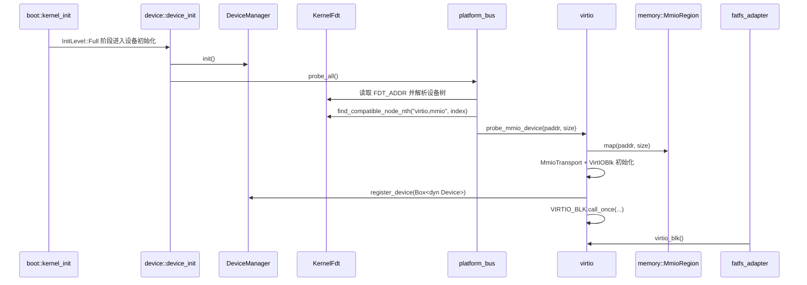

<!-- Copyright The SimpleKernel Contributors -->

# 设备子系统当前设计

> 本文描述 `src/device/` 当前实现和下一步演进边界。历史 P6 计划见
> [P6-设备框架与驱动.md](P6-设备框架与驱动.md)；`rdrive` 取舍见
> [ADR-020](../adr/020-borrow-rdrive-patterns-local-device-framework.md)。

## 当前结论

SimpleKernel 保留本地 `crate::device` 作为设备子系统边界。设备框架后续借鉴 `rdrive`
的 driver descriptor、probe kind、probe level、priority 和 FDT compatible 匹配思路，
但不直接把 `rdrive` 作为核心设备框架引入。

当前实现仍是一个薄设备模型：

- `src/device/mod.rs` 定义 `Device` / `DeviceType` 和 `device_init()`；
- `src/device/manager.rs` 用 `SpinLock<Vec<Box<dyn Device>>>` 保存已注册设备；
- `src/device/platform_bus.rs` 从 FDT 枚举 `virtio,mmio` 节点；
- `src/device/virtio.rs` 使用 `virtio-drivers` 初始化 VirtIO block，并通过全局
  `virtio_blk()` 暴露给 `src/fs/fatfs_adapter.rs`；
- MMIO 通过 `memory::MmioRegion` 永久映射，DMA 继续走 `crates/dma` 的 QEMU identity
  backend 边界。

## 运行时路径

这条路径是当前代码真值面。`DeviceManager` 只记录枚举结果；块设备实际 I/O 仍通过
`virtio_blk()` 取得具体 VirtIO 设备。

## 边界和不变量

- `crate::device` 是上层模块依赖的本地门面，`fs`、`task`、`syscall` 不应直接依赖
  `rdrive::Device<T>`、`rdif-*` 或 `mmio-api`。
- 设备 registry 必须接入 SimpleKernel 自己的锁级别和中断安全规则，不能默认替换为
  第三方 `spin::Mutex` / `RwLock`。
- MMIO 仍由 `memory::MmioRegion` 表达设备寄存器窗口；设备框架不能引入另一个全局 MMIO
  操作入口绕过该边界。
- DMA 语义继续按 `crates/dma` 和 ADR-014 收口：当前只承诺 QEMU identity mapping，
  不声明 non-coherent 真机 DMA 正确。
- FDT、MMIO size、DMA capability、设备类型等平台输入必须显式校验；缺失或非法输入应
  fail fast 或返回可诊断错误，不能用隐式默认值掩盖。
- 自动链接段注册不是第一阶段目标；若后续采用 `.driver.register*`，必须同步链接脚本、
  起止符号、保留规则和链接段回归测试。

## 演进路径

| 阶段 | 目标 | 兼容约束 |
|------|------|----------|
| D0 | 保持当前 VirtIO block + FAT 路径稳定 | 保留 `device_count()` 和 `virtio_blk()` |
| D1 | 新增本地 `BlockDevice` trait 和块设备门面 | `fatfs_adapter` 迁移后再弱化 VirtIO 具体依赖 |
| D2 | 新增本地 `DriverDescriptor` / `ProbeKind` / `ProbeLevel` / `ProbePriority` | 先支持 Static / FDT，PCIe 后续按需求加入 |
| D3 | 将 `platform_bus` 从集中式 match 迁移为 descriptor 驱动的 compatible 匹配 | 保持 `device-test` 和 FAT 回归可运行 |
| D4 | 设备 registry 表达 typed capability、device id、依赖关系和重复注册诊断 | 上层仍只依赖本地门面 |
| D5 | 如需复用 tgoskits 驱动，评估 `rdif-*` 适配层或隔离 `rdrive` POC | 不直接改变核心设备边界 |

## 非目标

- 当前不直接新增 `rdrive` Cargo 依赖。
- 当前不把 `rdif-*` 作为 SimpleKernel 上层公共接口。
- 当前不引入 PCIe、ACPI 或自动链接段驱动注册作为主路径。
- 当前不宣称真机 non-coherent DMA、IOMMU、bounce buffer 或 DMA mask 策略已经闭环。

## 验证入口

- `cargo xtask test --arch riscv64 --name device-test --timeout 30`
- `cargo xtask test --arch riscv64 --name fs-test --timeout 30`
- `cargo xtask test --arch riscv64 --timeout 30`

QEMU 相关命令必须设置 30 秒超时，并在超时后清理残留 `qemu-system` 进程。
