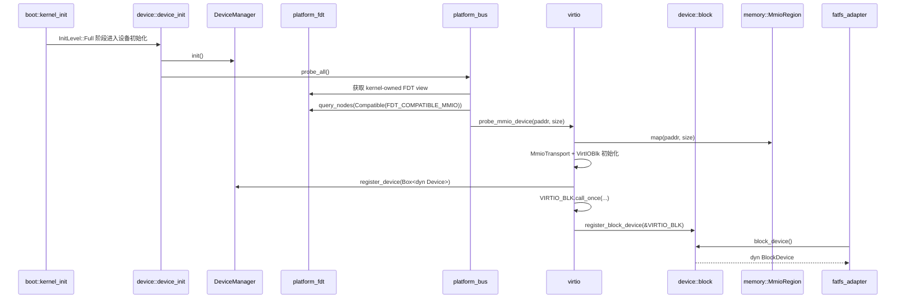

<!-- Copyright The SimpleKernel Contributors -->

# 设备子系统当前设计

> 本文描述 `src/device/` 当前实现和下一步演进边界。历史 P6 计划见
> [P6-设备框架与驱动.md](P6-设备框架与驱动.md)；`rdrive` 取舍见
> [ADR-020](../adr/020-borrow-rdrive-patterns-local-device-framework.md)。D2 方案见
> [R6/D2 设备驱动描述符与 Probe Registry 设计说明](device-d2-driver-descriptor-probe.md)。

## 当前结论

SimpleKernel 保留本地 `crate::device` 作为设备子系统边界。设备框架后续借鉴 `rdrive`
的 driver descriptor、probe kind、probe level、priority 和 FDT compatible 匹配思路，
但不直接把 `rdrive` 作为核心设备框架引入。

当前实现仍是一个薄设备模型：

- `src/device/mod.rs` 定义 `Device` / `DeviceType` 和 `device_init()`；
- `src/device/block.rs` 定义本地 `BlockDevice` trait 和默认块设备门面；
- `src/device/manager.rs` 用 `SpinLock<Vec<Box<dyn Device>>>` 保存已注册设备；
- `src/device/platform_bus.rs` 通过 VirtIO 驱动侧 compatible 常量查询 FDT 节点；
- `src/device/virtio.rs` 使用 `virtio-drivers` 初始化 VirtIO block，并通过全局
  `virtio_blk()` 保留兼容入口，同时把同一块设备注册为本地 `BlockDevice`；
- `src/fs/fatfs_adapter.rs` 通过 `crate::device::block::block_device()` 访问块设备，
  不再直接依赖 VirtIO 具体类型；
- MMIO 通过 `memory::MmioRegion` 永久映射，DMA 继续走 `crates/dma` 的 QEMU identity
  backend 边界。

## 运行时路径



这条路径是当前代码真值面。`DeviceManager` 只记录枚举结果；块设备实际 I/O 已通过
本地 `BlockDevice` 门面进入，`virtio_blk()` 仍作为兼容入口保留给测试和旧调用点。

## 边界和不变量

- `crate::device` 是上层模块依赖的本地门面，`fs`、`task`、`syscall` 不应直接依赖
  `rdrive::Device<T>`、`rdif-*` 或 `mmio-api`。
- 设备 registry 必须接入 SimpleKernel 自己的锁级别和中断安全规则，不能默认替换为
  第三方 `spin::Mutex` / `RwLock`。
- MMIO 仍由 `memory::MmioRegion` 表达设备寄存器窗口；设备框架不能引入另一个全局 MMIO
  操作入口绕过该边界。
- DMA 语义继续按 `crates/dma` 和 ADR-014 收口：当前只承诺 QEMU identity mapping，
  不声明 non-coherent 真机 DMA 正确。
- FDT、MMIO size、DMA capability、设备类型等平台输入必须显式校验；缺失或非法输入应
  fail fast 或返回可诊断错误，不能用隐式默认值掩盖。
- 自动链接段注册不是第一阶段目标；若后续采用 `.driver.register*`，必须同步链接脚本、
  起止符号、保留规则和链接段回归测试。

## D0.5 基线

D0.5 只强化当前 D0 的 VirtIO block 路径，不进入 D1 `BlockDevice` 门面实现：

- Full 初始化路径下，`platform_bus` 依赖 `early_init()` 初始化的 kernel-owned FDT view；
  FDT view 缺失、FDT 解析失败，或已匹配的 VirtIO MMIO 节点 `reg` 属性非法，均必须 fail-fast。
- `device-test` 必须把 `device_count() > 0`、`virtio_blk()` 可用，以及 sector 0 读取成功作为硬断言。
- `fatfs_adapter` 在 D0.5 不迁移，仍继续通过 `virtio_blk()` 访问当前 VirtIO 块设备。

## D1 当前状态

D1 已新增本地 `BlockDevice` trait 和默认块设备门面。D2 的
`DriverDescriptor` / probe registry / 最小 typed capability registry 方案已在
[R6/D2 设备驱动描述符与 Probe Registry 设计说明](device-d2-driver-descriptor-probe.md)
中收敛，尚未实现：

- `BlockDevice` 当前覆盖 `sector_size()`、`sector_count()`、字节容量 `capacity()`、
  以及 `read_sector()` / `write_sector()` 整扇区 I/O。
- VirtIO block 通过同一个全局 `SpinLock<VirtIOBlk<...>>` 实现 `BlockDevice`，
  所以 DMA、MMIO 和 QEMU identity backend 语义没有扩大。
- `fatfs_adapter` 已迁移到 `device::block::block_device()`，不再直接调用 `virtio_blk()`。
- `device-test` 以 `BlockDevice` 门面读取 sector 0，同时保留 `virtio_blk()` 兼容入口存在性检查。
- D2 实现尚未开始：当前代码没有新增 driver descriptor、probe priority、typed capability
  registry、PCIe、ACPI 或自动链接段注册。

## D2 设计入口

D2 的当前设计真值面是
[R6/D2 设备驱动描述符与 Probe Registry 设计说明](device-d2-driver-descriptor-probe.md)。
该文档已确认以下边界：

- D2 支持 `Static` / `Fdt`，不支持 PCIe、ACPI 或自动链接段注册。
- D2-0 已将平台描述层收口为 `crates/platform_fdt`，不保留旧 crate 名或兼容 re-export。
- `platform_fdt` 提供 `FdtSelector::{Path, Compatible}` 统一查询入口，返回 `FdtNodeList`
  和 borrowed node view；固定平台配置可用 path 查询，设备 probe 继续按 compatible 枚举。
- `platform_fdt` 查询层返回结构化错误，不在内部 panic；compatible 枚举为空不是错误，
  matched node 的必需属性非法必须作为错误返回。
- D2 registry 需要同一 DTB view 内稳定的 FDT node id；若当前 `FdtNodeId` 仍是 query-local
  ordinal，应先改为全 DTB 稳定 id。
- D2 引入本地 `DriverDescriptor`、`ProbeKind`、`ProbeRequirement`、`ProbeLevel` 和
  `ProbePriority`。
- `device_core` 可以有限依赖 `platform_fdt` 公开值类型，但不能调用 `platform_fdt::get()`、
  初始化 DTB storage 或自行扫描全局 FDT。
- `ProbeContext::Fdt` 只携带按值的 `FdtProbeContext`，包含稳定 `FdtNodeId`、
  `FdtNodeName<'static>`、matched compatible 和 `FdtReg`；registry 不保存 borrowed
  `FdtNodeView<'_>` / `FdtNodeList<'_>`。
- D2 同时引入最小 typed capability registry，首批只要求覆盖 `DeviceCapability::Block`；
  `BlockDevice` trait 和 `BlockError` 放在 `device_core`，`src/device/block.rs` 作为兼容门面。
- 多个 FDT 节点拥有同一 compatible 是正常多设备实例；descriptor 侧同一 compatible
  重复注册禁止，设备绑定状态以稳定 `FdtNodeId` 为准。
- 默认 `block_device()` 由 descriptor/probe 顺序中第一个成功注册的 `Block` capability 决定。
- `ProbeLevel::Late` 保留给后续依赖已有 capability 的后置初始化，D2 首批不使用。
- D2a-D2c 期间 `device_count()`、`virtio_blk()`、`block_device()`、`device-test` 和 `fs-test`
  仍是兼容约束；D2 收口后应删除 `virtio_blk()` 具体驱动入口和旧 `DeviceManager` 公共路径。
- D2a 允许增加 descriptor / registry 纯逻辑 host unit test；真实 FDT / MMIO / VirtIO /
  DMA / `device_init()` 路径仍只通过 QEMU 系统测试验证，不引入 host mock。

## 演进路径

| 阶段 | 目标 | 兼容约束 |
|------|------|----------|
| D0 | 保持当前 VirtIO block + FAT 路径稳定 | 保留 `device_count()` 和 `virtio_blk()` |
| D0.5 | 强化当前 device-test 与 platform bus fail-fast 语义 | 不新增 `BlockDevice`，不改 `fatfs_adapter` |
| D1 | 新增本地 `BlockDevice` trait 和块设备门面 | 已落地；`virtio_blk()` 兼容入口暂时保留 |
| D2 | 新增本地 `DriverDescriptor` / `ProbeKind` / `ProbeRequirement` / `ProbeLevel` / `ProbePriority`，并将 `platform_bus` 迁移为 descriptor 驱动的 Static / FDT probe | 同步引入最小 typed capability registry；D2a-D2c 保留旧入口，D2 收口后清理 `virtio_blk()` 和旧 `DeviceManager` 公共路径 |
| D3 | 扩展 registry 能力和默认设备策略，例如分区块设备、root block 选择或 `Late` 后置初始化 | 以 D2 registry 为真值面，不恢复旧具体驱动入口 |
| D4 | 设备 registry 表达更完整的 device id、依赖关系、多能力查询和重复注册诊断 | 上层仍只依赖本地门面 |
| D5 | 如需复用 tgoskits 驱动，评估 `rdif-*` 适配层或隔离 `rdrive` POC | 不直接改变核心设备边界 |
| D6 | 预留受信任驱动模块 ABI，允许驱动以 `#[repr(C)]` descriptor 暴露注册入口 | 只设计 ABI，不加载外部代码 |
| D7 | 从文件系统加载受信任驱动模块，完成 ELF 装载、重定位和 registry 注册 | 需单独 ADR 和 loader 验证 |

## 动态驱动加载远期目标

后续如果要支持“从文件系统加载设备驱动”，应把目标拆成三层，而不是直接把
当前 `DeviceManager` 替换成动态模块加载器：

| 层级 | 含义 | 当前阶段定位 |
|------|------|--------------|
| 动态注册 | 驱动代码已编译进内核，启动或运行时注册 descriptor | R6 近期目标 |
| 动态探测 | registry 根据 Static / FDT / PCI 等资源匹配驱动 | R6 近期目标 |
| 动态加载代码 | 从文件系统读取驱动模块，重定位后注册到设备框架 | R6 之后的独立设计目标 |

在 SimpleKernel 的 SAS 架构下，动态加载的驱动模块与内核运行在同一特权级和同一地址空间。
因此动态驱动不是不受信任的用户态插件，而是受信任内核代码。它必须遵守内核的锁级别、
MMIO、DMA、panic/fail-fast 和可见性边界。

动态加载路径应遵守以下边界：

- Rust `dyn Trait` 不作为跨模块稳定 ABI。模块边界使用 `#[repr(C)]` descriptor、
  `extern "C"` 函数和显式 ABI version。
- 驱动模块通过内核提供的 `KernelDriverApi` 或等价函数表注册能力接口，不直接依赖
  `rdrive::Device<T>`、`rdif-*`、`mmio-api` 或 `dma_api::*`。
- 模块加载器负责读取模块文件、校验 ABI version 和签名或 hash、分配代码/数据段、
  执行 relocation、解析允许导出的内核符号，并设置代码页权限。
- 第一版动态加载应只支持 load，不支持 unload；卸载需要设备引用计数、正在执行的
  callback 排空、IRQ/DMA 停止、资源释放和并发访问屏障。
- 动态模块不得绕过 `memory::MmioRegion`、`crates/dma` 和设备 registry 的 typed
  capability 边界。

一个可演进的模块 descriptor 形态如下：

```rust
#[repr(C)]
pub struct DriverModuleDescriptor {
    pub abi_version: u32,
    pub name_ptr: *const u8,
    pub name_len: usize,
    pub init: extern "C" fn(api: *const KernelDriverApi) -> i32,
    pub deinit: extern "C" fn() -> i32,
}
```

该结构只表达远期 ABI 方向，不代表当前已实现动态模块加载。

### 后续待确认问题

这些问题应在后续 R6 / module-loader 设计对话中逐一确认：

1. 动态驱动是否只支持受信任、同版本内核构建产物，还是需要支持第三方模块。
2. 模块文件格式采用 relocatable ELF、shared object 风格 ELF，还是 SimpleKernel 自定义
   `.skmod` 容器。
3. 内核导出符号采用全局 symbol table、显式 `KernelDriverApi` 函数表，还是两者组合。
4. 第一版是否只支持加载不支持卸载。
5. 模块签名、hash、版本和依赖关系由谁生成和校验。
6. 加载后驱动的 panic、初始化失败、probe 失败和资源回滚语义如何定义。
7. 动态模块是否允许申请 DMA、注册 IRQ handler、访问 MMIO，以及这些 capability 如何授权。
8. QEMU 系统测试如何覆盖模块加载、重复注册、ABI mismatch、relocation 失败和 load 后块设备 I/O。

## 非目标

- 当前不直接新增 `rdrive` Cargo 依赖。
- 当前不把 `rdif-*` 作为 SimpleKernel 上层公共接口。
- 当前不引入 PCIe、ACPI 或自动链接段驱动注册作为主路径。
- 当前不实现从文件系统加载驱动代码；动态驱动加载需要单独 ADR、模块 ABI 和 loader 设计。
- 当前不宣称真机 non-coherent DMA、IOMMU、bounce buffer 或 DMA mask 策略已经闭环。

## 验证入口

- `cargo xtask test --arch riscv64 --name device-test --timeout 30`
- `cargo xtask test --arch riscv64 --name fs-test --timeout 30`
- `cargo xtask test --arch riscv64 --timeout 30`

QEMU 相关命令必须设置 30 秒超时，并在超时后清理残留 `qemu-system` 进程。
