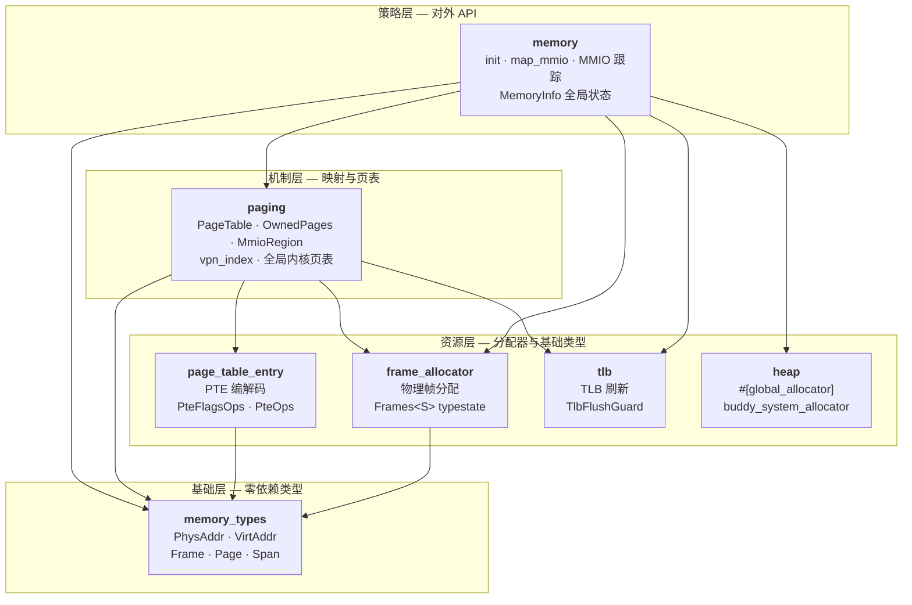
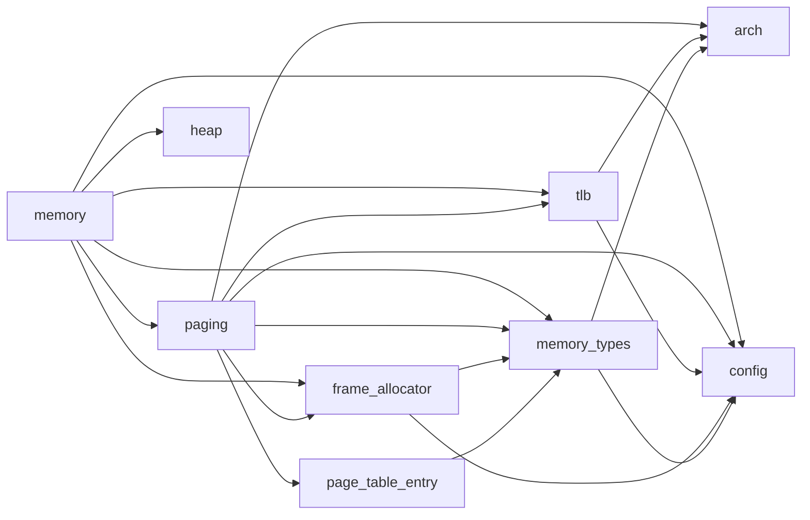
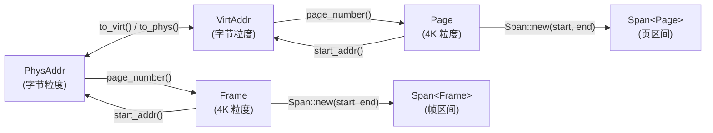
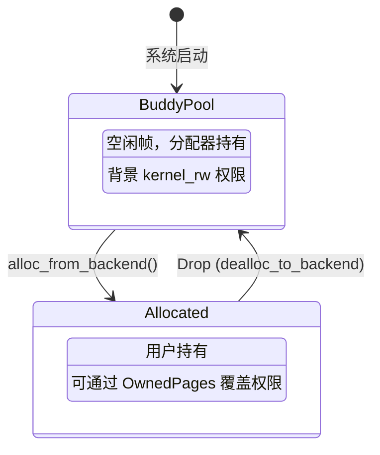
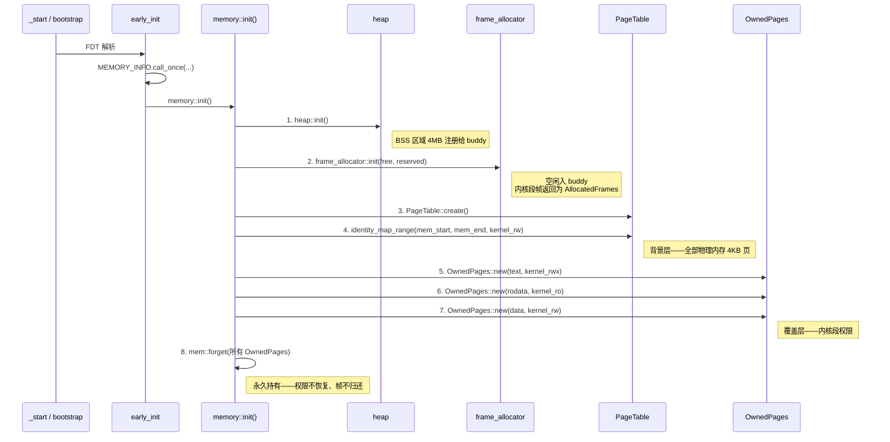
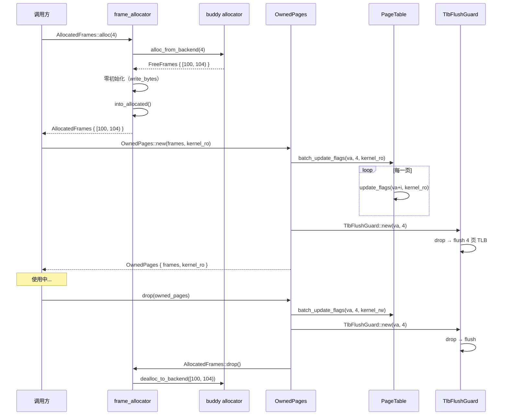
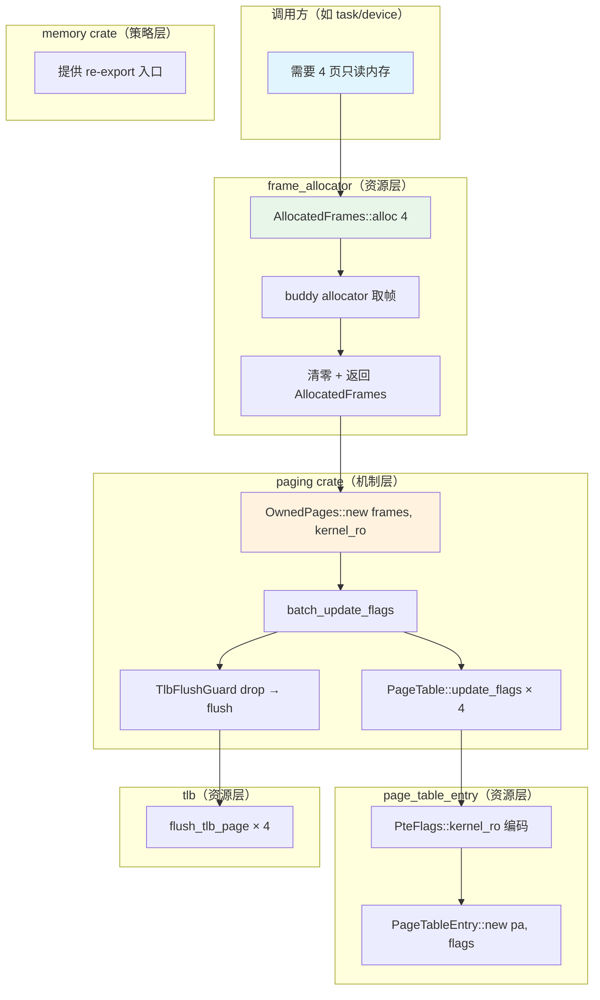

# 内存管理子系统 v2

> **⚠ 部分过时**：[ADR-013](../adr/013-ownedpages-necessity.md) 已删除
> `OwnedPages` 抽象层。本文档中所有涉及 `OwnedPages::new` / `OwnedPages::Drop` /
> "权限守卫" / §6 的描述均已不适用。当前设计：
>
> - 帧生命周期直接由 `AllocatedFrames` RAII 承担（Drop 归还 buddy）
> - 权限覆盖通过 `PageTable::update_range_flags(va, count, flags)` 方法执行
> - 内核段通过 `mem::forget(frames)` 永久持有，不经过任何守卫类型
>
> 其余部分（分层、全量映射模型、PageTable 设计、MmioRegion）仍然有效。
> 读者以源码为准（`crates/paging/src/table.rs`、`crates/memory/src/init.rs`）。
>
> 本文档面向**内核开发者**，系统描述 SimpleKernel 内存管理的设计哲学、
> 所有权模型和生命周期流转。读完本文你应该能回答：
>
> - SimpleKernel 的内存模型与 Theseus 等内核有什么根本区别？
> - 一个物理帧从分配到回收经历了哪些类型状态？
> - 各 crate 之间如何协同工作，对外接口是什么？
> - 为什么不需要大页和 page splitting？
>
> ADR-013 之后，帧所有权由 `AllocatedFrames` RAII 直接承担，
> 权限覆盖由 `PageTable::update_range_flags` 方法幂等施加——不再有中间守卫类型。
>
> 演进历史：本文档取代 [memory-subsystem.md](memory-subsystem.md)（旧设计）。
> 决策记录见 [ADR-006](../adr/006-memory-subsystem-simplification.md)、
> [ADR-007](../adr/007-eliminate-vma-and-dead-code.md)、
> [ADR-013](../adr/013-ownedpages-necessity.md)。

---

## 1. 设计哲学

SimpleKernel 内存子系统基于三条原则：

### 1.1 比 Theseus 更激进的 SAS

SimpleKernel 采用单地址空间（SAS）架构，所有代码运行在同一特权级和地址空间中。
与 Theseus 不同的是，SimpleKernel 对全量映射做了更激进的选择：**所有物理内存在
boot 时一次性 identity map，运行时永远不创建或删除 PTE**。

这意味着页表的角色发生了根本变化：

| | Theseus | SimpleKernel |
|--|---------|-------------|
| 页表角色 | **隔离机制**——PTE 有无决定帧能否访问 | **权限管控**（纵深防御）——PTE 始终存在 |
| "映射"的含义 | 创建 VA→PA 翻译（PTE 从无到有） | 不存在——所有翻译永远存在 |
| 帧可访问性 | 取决于有没有 PTE 指向它 | 始终可访问（identity mapping） |
| 分配后的帧 | 需要先 map 才能用 | 分配完就能用（背景 kernel_rw） |
| 帧所有权追踪 | PTE EXCLUSIVE 位（运行时硬件位） | Rust struct 字段（编译期） |

### 1.2 内存充裕——全量映射无代价

现代计算机的物理内存远小于虚拟地址空间（RISC-V Sv39: 512GB，AArch64-48bit: 256TB）。
全量映射所有物理内存的页表开销在 128MB RAM 下约 264KB（0.2%），可忽略。
这个前提让我们可以在 boot 时一次性建立完整映射，运行时只管权限。

### 1.3 编译期保证优于运行时保证

帧的生命周期完全由 Rust 类型系统在编译期追踪：

- **帧不会 double-free**——Rust 所有权唯一（编译期强制）
- **帧不会泄漏**——`OwnedPages::Drop` 必然执行（编译期强制）
- **Drop 恢复权限**——结构体析构顺序确定（编译期强制）
- **映射存活期间帧不被回收**——字段与 struct 同生命周期（编译期强制）

不依赖运行时 panic 保护网、不依赖 PTE 软件位标记、不依赖引用计数。

### 1.4 学术定位

SimpleKernel 处于以下研究线的交汇点：

| 研究方向 | 代表系统 | SimpleKernel 的取法 |
|---------|---------|-------------------|
| 全量映射 | Linux direct map, rCore identity map | 相同——全部物理内存一次性映射 |
| 语言级隔离 | Theseus OSDI'20, RedLeaf OSDI'20, SPIN SOSP'95 | 相同——Rust 编译器是保护环 |
| 权限覆盖 | Intel MPK, ARM POE, libhermitMPK VEE'20 | 软件层实现——映射不变，只改权限 |
| 纵深防御 | SafeBPF CCSW'24, Unishyper EMSOFT'23 | 语言安全（主）+ PTE 权限（辅） |
| SAS + 语言安全 | Singularity MSR'05 | 类似——但 Singularity 用 GC 语言，SimpleKernel 用 Rust 零开销所有权 |

完整参考文献见 `docs/design/references.md`。

### 1.5 安全 trade-off

全量映射意味着：任何 `unsafe` 代码可通过裸指针访问任何物理内存。
防线是：

1. APP crate 标记 `#![forbid(unsafe_code)]`——编译器禁止 unsafe
2. 内核内部 `unsafe` 集中在少数底层 crate 并严格审计
3. PTE 权限位作为纵深防御——即使有 unsafe 越权，NX/RO 仍能拦截部分操作

这是有意识的取舍：更强的编译期保证 + 更弱的硬件兜底。
如果需要运行不受信任的二进制，那就不再是 SAS——需要从根本上重新设计。

---

## 2. 架构总览

内存子系统由多个 crate 组成，分为三层：



### 各层职责

| 层 | Crate | 职责 | 不做什么 |
|----|-------|------|---------|
| **策略** | `memory` | 初始化编排、MMIO 注册/重叠检测、对外 re-export | 不直接操作 PTE |
| **机制** | `paging` | 页表遍历、PTE 读写、OwnedPages 权限管理、MmioRegion | 不管"何时"映射——由上层决定 |
| **资源** | `frame_allocator` | 物理帧的分配/回收/typestate 追踪 | 不知道页表的存在 |
| **资源** | `page_table_entry` | 单个 PTE 的 bit-level 编解码（跨架构） | 不做页表遍历 |
| **资源** | `tlb` | 架构无关的 TLB invalidate（RAII guard + shootdown） | 仅 flush，不操作 PTE |
| **资源** | `heap` | `#[global_allocator]`（Box/Vec/BTreeMap） | 不管物理帧，仅管堆内存 |
| **基础** | `memory_types` | 地址/帧号 newtype、Span 区间 | 无运行时状态，纯类型 |

### Crate 依赖关系图



**无循环依赖**的关键：
- `memory_types` 依赖 `arch`（获取 PA_BITS/VA_BITS）和内联的 `Span` 类型，但 `arch` 不依赖 `memory_types`
- `page_table_entry` 通过 `cfg` 条件编译选择架构，不依赖 `arch` crate
- `paging` 通过 `arch` 获取 `PT_LEVELS`、`flush_tlb_*` 等常量和函数

---

## 3. 基础类型——`memory_types` + `span`

所有内存操作的基石是编译期区分物理/虚拟的 newtype：



### 3.1 地址类型

```rust
// 物理地址——字节粒度，PA_BITS 以内
pub struct PhysAddr(usize);

// 虚拟地址——字节粒度，需规范化（高位符号扩展）
pub struct VirtAddr(usize);
```

**PhysAddr 接口：**

| 方法 | 说明 |
|------|------|
| `new(v: usize) -> Self` | 构造并校验 PA_BITS |
| `as_usize() -> usize` | 获取原始值 |
| `page_offset() -> usize` | 页内偏移（低 12 位） |
| `is_aligned() -> bool` | 是否页对齐 |
| `align_down() -> Self` | 向下对齐到页边界 |
| `align_up() -> Self` | 向上对齐到页边界 |
| `page_number() -> Frame` | 转换为帧号 |
| `to_virt() -> VirtAddr` | identity mapping: VA = PA |

**VirtAddr 接口：**

| 方法 | 说明 |
|------|------|
| `new(v: usize) -> Self` | 构造并校验规范化 |
| `as_ptr<T>() -> *const T` | 转为裸指针 |
| `as_mut_ptr<T>() -> *mut T` | 转为可变裸指针 |
| `to_phys() -> PhysAddr` | identity mapping: PA = VA |
| `page_number() -> Page` | 转换为页号 |

### 3.2 帧/页号

```rust
pub struct Frame { number: usize }  // 4K 单位
pub struct Page  { number: usize }  // 4K 单位
```

帧/页号支持 `Add<usize>`、`Sub<usize>`、`Sub<Self> -> usize` 算术运算，
所有运算都是 checked（溢出 panic）。

### 3.3 Span 区间

定义在 `memory_types` 内部（不是独立 crate）。

```rust
pub struct Span<A: Copy + Ord> { start: A, end: A }  // [start, end)
```

| 方法 | 说明 |
|------|------|
| `new(start, end)` | 构造半开区间（start > end 时 panic） |
| `start() / end()` | 获取边界 |
| `size() -> usize` | 区间大小（需 `Sub` trait bound） |
| `overlaps(other)` | 重叠检测 |

---

## 4. 物理帧生命周期——`frame_allocator`

### 4.1 2-state typestate

物理帧使用 **const generic typestate** 追踪所有权：



只有两个状态——帧在分配器中（Free）或被外部持有（Allocated）。

```rust
#[derive(PartialEq, Eq, ConstParamTy)]
pub enum FrameState {
    Free,       // 分配器持有
    Allocated,  // 被某个 Rust struct 持有
}

pub struct Frames<const S: FrameState> {
    range: FrameSpan,  // 连续物理帧 [start, end)
}

pub type FreeFrames = Frames<{ FrameState::Free }>;
pub type AllocatedFrames = Frames<{ FrameState::Allocated }>;
```

Drop 行为统一——所有状态的帧都归还分配器：

```rust
impl<const S: FrameState> Drop for Frames<S> {
    fn drop(&mut self) {
        dealloc_to_backend(self.range);
    }
}
```

### 4.2 为什么只有 2 个状态

旧设计（来自 Theseus）有 4 个状态：Free / Allocated / Mapped / Unmapped。
Mapped/Unmapped 在 Theseus 中追踪 PTE 生命周期：

- `Mapped`：帧地址已写入 PTE（帧"沉入"页表）
- `Unmapped`：PTE 已清零（帧从页表"恢复"）
- `MappedFrames::Drop` panic——防止帧卡在 PTE 里无法回收

在 SimpleKernel 全量映射下，这些都不适用：

- PTE 始终存在——帧从不"沉入"或"恢复"
- 帧始终在 `OwnedPages` 的 struct 字段中——Rust 所有权直接追踪
- 不需要运行时 panic 保护网——编译器保证 `OwnedPages::Drop` 必然执行

2-state 让帧所有权完全由 Rust 类型系统追踪，消除了 `ManuallyDrop` + `unsafe`。

### 4.3 公开接口

**分配（`AllocatedFrames`）：**

| 方法 | 签名 | 说明 |
|------|------|------|
| `alloc_one` | `() -> Result<Self, FrameAllocError>` | 分配 1 帧，清零 |
| `alloc` | `(count: usize) -> Result<Self, FrameAllocError>` | 分配 N 连续帧，清零 |
| `count` | `(&self) -> usize` | 帧数量 |
| `start_paddr` | `(&self) -> PhysAddr` | 起始物理地址 |

**初始化（模块级）：**

```rust
pub unsafe fn init(
    free_start: PhysAddr,
    free_size: usize,
    reserved: &[(PhysAddr, usize)],  // (起始地址, 帧数)
) -> heapless::Vec<AllocatedFrames, 8>
```

**错误类型：**

```rust
pub enum FrameAllocError {
    AllocationFailed,  // 分配器未初始化
    OutOfMemory,       // 帧耗尽
}
```

### 4.4 分配器后端

```rust
static FRAME_ALLOCATOR: SpinLockIrq<FrameAllocatorInner>;

// 唯一的分配出口
fn alloc_from_backend(count: usize) -> Result<FreeFrames, FrameAllocError>;

// 唯一的回收入口（仅由 Frames::Drop 调用）
fn dealloc_to_backend(range: FrameSpan);
```

后端使用 `buddy_system_allocator::FrameAllocator<32>`：
- O(log n) alloc / dealloc（buddy 合并）
- 元数据存储在堆上的 BTreeSet，不触碰空闲帧内存
- 分配结果按 next_power_of_two 对齐——满足硬件对齐需求

### 4.5 初始化

`init()` 接受两类参数：

- `free_start` / `free_size`：空闲物理内存范围，加入 buddy
- `reserved`：预留的物理地址范围（内核 .text/.rodata/.data 段），
  **不经过 buddy**——直接构造为 `AllocatedFrames` 返回

预留范围的帧从未在 buddy 中注册。如果意外 Drop，`dealloc_to_backend`
会将未注册的帧交给 buddy 导致状态污染。

**不变量**：内核段帧由 `mem::forget` 永久持有——权限已写入页表，
Drop 永不执行（不恢复权限、不归还帧）。

### 4.6 连续帧分配

所有分配返回单个连续范围（`FrameSpan`）。这是 SAS identity mapping 下的自然约束：

| 好处 | 原因 |
|------|------|
| 映射简单 | 一个 `FrameSpan`，不需要 scatter-gather 列表 |
| DMA 友好 | 大多数 DMA 控制器要求物理连续 buffer |
| 硬件预取有效 | CPU prefetcher 按物理地址模式预取 |

---

## 5. PTE 编解码——`page_table_entry`

### 5.1 Trait 接口

```rust
/// 页表项标志位——工厂 + 查询 + Builder 三类方法
pub trait PteFlagsOps: Copy + Debug {
    // 工厂方法（创建权限预设）
    fn kernel_rw() -> Self;
    fn kernel_rx() -> Self;
    fn kernel_ro() -> Self;
    fn kernel_rwx() -> Self;
    fn kernel_device() -> Self;
    fn user_rw() -> Self;
    fn user_rx() -> Self;
    fn user_ro() -> Self;
    fn user_rwx() -> Self;

    // 查询方法
    fn is_readable(self) -> bool;
    fn is_writable(self) -> bool;
    fn is_executable(self) -> bool;
    fn is_user(self) -> bool;
    fn is_accessed(self) -> bool;
    fn is_dirty(self) -> bool;

    // Builder 方法（用于 COW/mprotect）
    fn with_writable(self, w: bool) -> Self;
    fn with_executable(self, x: bool) -> Self;
    fn for_leaf_at_level(self, level: usize) -> Self;
}

/// 页表项——编码/解码物理地址 + 标志位
pub trait PteOps: Copy + Debug {
    type Flags: PteFlagsOps;
    fn new(paddr: PhysAddr, flags: Self::Flags) -> Self;
    fn paddr(self) -> PhysAddr;
    fn flags(self) -> Self::Flags;
    fn is_valid(self) -> bool;
    fn is_leaf(self, level: usize) -> bool;
    fn empty() -> Self;
    fn new_intermediate(paddr: PhysAddr) -> Self;
    fn from_raw(raw: u64) -> Self;
    fn as_raw(self) -> u64;
}
```

### 5.2 条件编译导出

```rust
#[cfg(bare_riscv64)]
pub use riscv64::{PageTableEntry, PteFlags};

#[cfg(bare_aarch64)]
pub use aarch64::{PageTableEntry, PteFlags};
```

上层代码只使用 `PageTableEntry` / `PteFlags`，架构差异完全封装。

---

## 6. 权限覆盖——`OwnedPages`

### 6.1 核心概念：背景层 + 覆盖层

```
物理内存全貌:
┌──────────────────────────────────────────────────────┐
│ .text        │ .rodata   │ .data/.bss │  free pool   │
│ RWX          │ RO        │ RW         │  kernel_rw   │  ← 背景层（init 建立，永久）
│              │           │            │              │
│ [mem::forget]│[mem::forget]│[mem::forget]│  ┌─OwnedP─┐  │
│              │           │            │  │ RO      │  │  ← 覆盖层（运行时，临时）
│              │           │            │  └─────────┘  │
└──────────────────────────────────────────────────────┘
```

- **背景层**：`memory::init()` 建立，identity map 全部物理内存为 kernel_rw，永不变化
- **覆盖层**：`OwnedPages::new` 将特定帧的 PTE 权限改为指定值，
  `OwnedPages::Drop` 恢复回 kernel_rw

`OwnedPages` 是一个**权限守卫**（permission guard），
与 `MutexGuard` 同一模式：构造时获取资源，析构时释放资源。

### 6.2 结构

```rust
pub struct OwnedPages {
    frames: AllocatedFrames,  // 帧所有权——直接持有，无 ManuallyDrop
    flags: PteFlags,          // 当前权限
}
// 不可 Clone，不可 Copy——move-only 仿射类型
```

### 6.3 公开接口

| 方法 | 签名 | 说明 |
|------|------|------|
| `new` | `(frames: AllocatedFrames, flags: PteFlags) -> Self` | 接管帧所有权 + 更新 PTE 权限 |
| `set_flags` | `(&mut self, new_flags: PteFlags)` | 修改权限（遍历 PTE + TLB flush） |
| `vaddr` | `(&self) -> VirtAddr` | 起始虚拟地址（PA.to_virt()） |
| `size` | `(&self) -> usize` | 总大小（字节） |
| `page_count` | `(&self) -> usize` | 页数 |
| `flags` | `(&self) -> PteFlags` | 当前权限 |

**Drop 行为：**

```rust
impl Drop for OwnedPages {
    fn drop(&mut self) {
        batch_update_flags(self.vaddr(), self.page_count(), PteFlags::kernel_rw());
        // AllocatedFrames 自动 Drop → dealloc_to_backend
    }
}
```

**零 unsafe**——帧管理完全通过 Rust 所有权系统。

### 6.4 编译期保证

| 保证 | 如何实现 |
|------|---------|
| 帧不会 double-free | Rust 所有权唯一（编译期） |
| 帧不会泄漏 | `OwnedPages::Drop` 必然执行（编译期） |
| Drop 恢复权限 | Drop 方法体显式调用 `batch_update_flags`（编译期确定） |
| 映射存活期间帧不被回收 | `frames` 字段与 `OwnedPages` 同生命周期（编译期） |

### 6.5 与 Theseus `MappedPages` 的对比

| | Theseus `MappedPages` | SimpleKernel `OwnedPages` |
|--|----------------------|--------------------------|
| 持有帧？ | **否**——帧沉入 PTE | **是**——`AllocatedFrames` 字段 |
| 持有页？ | 是——`AllocatedPages` 字段 | 否——VA 从 PA 推导（identity mapping） |
| 构造 | `map(pages, frames, flags)` | `new(frames, flags)` |
| 析构 | 清零 PTE + 回收帧（从 PTE 恢复）+ 回收页 | 恢复 PTE 权限 + 释放帧（从 struct 字段） |
| unsafe | `mem::forget` + `unsafe from_unmapped_range` | 零 |
| 帧 typestate | 4 状态（追踪 PTE 生命周期） | 2 状态（追踪分配器所有权） |

---

## 7. MMIO 区域——`MmioRegion`

MMIO 地址是硬件寄存器，**不是 RAM**，不在 buddy allocator 中。
`MmioRegion` 与 `OwnedPages` 是平级类型，各自独立：

```rust
pub struct MmioRegion {
    base: VirtAddr,
    size: usize,
}
```

### 7.1 公开接口

| 方法 | 签名 | 说明 |
|------|------|------|
| `map` | `(paddr: PhysAddr, size: usize) -> Result<Self, PagingError>` | 按页对齐 identity-map |
| `base` | `(&self) -> VirtAddr` | MMIO 基地址 |
| `size` | `(&self) -> usize` | 映射大小 |
| `read_reg<T: FromBytes>` | `(&self, offset: usize) -> T` | volatile 读 |
| `write_reg<T: IntoBytes>` | `(&self, offset: usize, val: T)` | volatile 写 |

### 7.2 与 OwnedPages 的区别

| | OwnedPages | MmioRegion |
|--|-----------|-----------|
| 帧来源 | buddy allocator | 硬件固定地址 |
| 权限 | 任意 | 始终 kernel_device() |
| 生命周期 | Drop 时恢复 + 归还帧 | 永久映射，不 unmap |
| 帧所有权 | 持有 `AllocatedFrames` | 不持有（非 RAM） |

---

## 8. 页表——`paging::PageTable`

### 8.1 结构

```rust
pub struct PageTable {
    root: AllocatedFrames,                    // 根帧所有权
    root_ref_count: u16,                      // 根帧有效 PTE 数
    nodes: BTreeMap<PhysAddr, NodeEntry>,      // 中间节点
}

struct NodeEntry {
    _frame: AllocatedFrames,  // 帧所有权
    ref_count: u16,           // 有效 PTE 数
}
```

SAS 架构下全局唯一，`SpinLock` 保护。

### 8.2 多级遍历

```
RISC-V Sv39 (3 级)          AArch64 4KB (4 级)
Level 2 (root)              Level 3 (root)
  └─ Level 1                  └─ Level 2
       └─ Level 0 (4KB 叶)        └─ Level 1
                                        └─ Level 0 (4KB 叶)
```

所有映射均为 4KB 叶页（level 0）。不支持大页（2MB/1GB），
消除了 page splitting 和多级 map/unmap 的复杂性。

### 8.3 公开接口

| 方法 | 签名 | 说明 |
|------|------|------|
| `create` | `() -> Result<Self, PagingError>` | 新建页表（分配根帧） |
| `root_paddr` | `(&self) -> PhysAddr` | 根帧地址（写 SATP/TTBR） |
| `set_page_flags` | `(&mut self, va, pa, flags) -> Result<(), PagingError>` | 创建/更新 PTE |
| `update_flags` | `(&mut self, va, new_flags) -> Result<PteFlags, PagingError>` | 仅改权限 |
| `get_mapping` | `(&self, va) -> Option<(PhysAddr, PteFlags)>` | 查询映射 |
| `identity_map_range` | `(&mut self, start, end, flags)` | 批量 identity map |

**`set_page_flags` 语义**（SAS 全量映射下）：
- VA 无 PTE → 创建 Level 0 叶 PTE
- VA 有 PTE 且 PA 相同 → 按需更新 flags（幂等）
- VA 有 PTE 但 PA 不同 → panic（内核 bug）

### 8.4 全局内核页表

```rust
// sync_crate::SpinLock 是项目自定义的中断感知自旋锁（非 spin::Mutex）
static KERNEL_PAGE_TABLE: spin::Once<sync_crate::SpinLock<PageTable>>;

pub fn init_kernel_page_table(pt: PageTable);     // 初始化（仅一次）
pub fn kernel_page_table() -> &'static sync_crate::SpinLock<PageTable>;  // 获取
```

---

## 9. TLB 管理——`tlb`

### 9.1 接口

| 函数/类型 | 说明 |
|-----------|------|
| `flush_tlb()` | 刷新整个 TLB（本核 + shootdown） |
| `flush_tlb_page(vaddr)` | 刷新单页 TLB 条目 |
| `TlbFlushGuard::new(start_vaddr, page_count)` | RAII 守卫，drop 时自动 flush |
| `register_tlb_shootdown(fn)` | 注册跨核 IPI 回调 |

### 9.2 刷新策略

```rust
impl Drop for TlbFlushGuard {
    fn drop(&mut self) {
        if page_count <= TLB_FLUSH_THRESHOLD {
            // 逐页 flush（精确、低开销）
        } else {
            // 全局 flush（简单、批量操作更高效）
        }
    }
}
```

---

## 10. 堆分配器——`heap`

```rust
pub unsafe fn init();  // 将 BSS 中 KERNEL_HEAP_SIZE 字节注册给 buddy
```

- 后端：`buddy_system_allocator::Heap<32>`
- 保护：`SpinLock` 包装，中断上下文断言（`assert_not_in_irq()`）
- 容量：`config::KERNEL_HEAP_SIZE`（默认 4MB）
- 用途：为内核 `Box`/`Vec`/`BTreeMap` 等提供 `#[global_allocator]`

**重要约束**：堆必须在帧分配器之前初始化——buddy 内部用堆上 BTreeSet。

---

## 11. 门面——`memory` crate

`memory` crate 是面向内核其他模块的**唯一公共 API 入口**。

### 11.1 Re-exports

```rust
pub use frame_allocator as frame;   // 物理帧分配
pub use heap_crate as heap;         // 堆分配器
pub use tlb;                        // TLB 管理
pub use paging::error::PagingError; // 映射错误
pub use globals::{MEMORY_INFO, MemoryInfo};  // 全局内存布局
pub use init::{init, init_smp};     // 初始化入口
```

### 11.2 map_mmio

```rust
pub fn map_mmio(paddr: PhysAddr, size: usize) -> Result<VirtAddr, MemoryError>;
```

内部流程：
1. `MmioRegion::map(paddr, size)` → identity-map 为 kernel_device()
2. `check_mmio_overlap(base, size)` → 检测冲突
   - 完全相同区域 → `MmioIdentical`（幂等，安全忽略）
   - 部分重叠 → `MmioOverlap`（panic）
3. 注册到 `MMIO_REGIONS: BTreeMap<VirtAddr, usize>`
4. 返回 `paddr.to_virt()`（精确地址，非对齐后地址）

### 11.3 错误类型

```rust
pub enum MemoryError {
    AllocationFailed,  // 帧分配器未初始化
    OutOfMemory,       // 物理帧耗尽
    MapFailed,         // 页表映射失败
    PageNotMapped,     // 目标虚拟页未映射
    InvalidPageTable,  // 全局内核页表未初始化
    MmioIdentical,     // MMIO 区域完全重合（幂等）
    MmioOverlap,       // MMIO 区域部分重叠（冲突）
}

impl From<FrameAllocError> for MemoryError { ... }
impl From<PagingError> for MemoryError { ... }
```

---

## 12. 初始化顺序



**先背景、后覆盖**：步骤 4 建立全量映射（所有 PTE 存在），
步骤 5-7 的 `OwnedPages::new` 通过 `update_flags` 覆盖内核段权限。
data 段权限与背景相同（kernel_rw），但 `OwnedPages` 追踪其所有权。

**约束**：
- 堆必须在帧分配器之前（buddy 内部用堆上 BTreeSet）
- 背景映射在 OwnedPages 之前（OwnedPages 内部用 `update_flags`，要求 PTE 已存在）
- 从核复用主核页表，只需激活分页

**从核初始化：**

```rust
pub fn init_smp(activate: impl FnOnce(&PageTable)) {
    let guard = paging::kernel_page_table().lock();
    activate(&guard);  // 架构相关：写 SATP/TTBR 寄存器
}
```

---

## 13. 端到端数据流

### 13.1 运行时帧分配的一生



### 13.2 内核段映射的一生

```
1. frame_allocator::init(reserved=[(text, N), (rodata, M), (data, K)])
   └─ 直接构造 AllocatedFrames（不经 buddy）

2. identity_map_range(mem_start, mem_end, kernel_rw)
   └─ 全部物理内存建立背景映射

3. OwnedPages::new(text_frames, kernel_rwx)
   └─ update_flags → 覆盖 .text 段权限

4. mem::forget(owned_pages)
   └─ Drop 永不执行 → 权限永不恢复、帧永不归还
   └─ 内核段与内核同生命周期
```

### 13.3 MMIO 映射的一生

```
1. memory::map_mmio(paddr=0x1000_0000, size=0x1000)
   └─ MmioRegion::map(paddr, size)
       └─ 页对齐: [0x1000_0000, 0x1000_1000)
       └─ identity_map_range(..., kernel_device())
   └─ check_mmio_overlap(base, size)
       └─ 无冲突 → 注册到 MMIO_REGIONS
   └─ 返回 VirtAddr(0x1000_0000)

2. 设备驱动使用
   └─ mmio.read_reg::<u32>(0x04)   → volatile read at 0x1000_0004
   └─ mmio.write_reg::<u32>(0x08, val) → volatile write at 0x1000_0008

3. 永久存在——MmioRegion 不实现 unmap
```

---

## 14. 协同工作流程图

以下展示一次完整的"分配帧 → 设置权限 → 使用 → 释放"流程中各 crate 的协作：



---

## 15. 接口速查表

### 15.1 按使用场景

| 场景 | 调用 | 结果 |
|------|------|------|
| 分配 N 帧 | `AllocatedFrames::alloc(n)?` | 连续帧，已清零 |
| 设置权限保护 | `OwnedPages::new(frames, flags)` | RAII 权限守卫 |
| 修改权限 | `owned.set_flags(new_flags)` | PTE 更新 + TLB flush |
| 释放帧 | `drop(owned_pages)` | 恢复 kernel_rw + 归还 buddy |
| 映射 MMIO | `memory::map_mmio(paddr, size)?` | VirtAddr（永久映射） |
| MMIO 读写 | `mmio.read_reg::<u32>(offset)` | volatile 语义 |
| 查询映射 | `pt.get_mapping(va)` | `Option<(PhysAddr, PteFlags)>` |

### 15.2 按 crate

| Crate | 主要公开类型/函数 | 典型用法 |
|-------|------------------|---------|
| `memory_types` | `PhysAddr`, `VirtAddr`, `Frame`, `Page`, `Span<A>` | 类型安全地址传递 |
| `frame_allocator` | `AllocatedFrames::alloc()`, `::alloc_one()` | 物理帧分配 |
| `page_table_entry` | `PteFlags::kernel_rw()` 等工厂方法 | 权限预设 |
| `paging` | `OwnedPages`, `MmioRegion`, `PageTable` | 权限管理和映射 |
| `tlb` | `TlbFlushGuard`, `flush_tlb()`, `flush_tlb_page()` | TLB 维护 |
| `heap` | `heap::init()` | 仅初始化时使用 |
| `memory` | `init()`, `init_smp()`, `map_mmio()` | 子系统初始化和 MMIO |

---

## 16. unsafe 边界总结

| 位置 | unsafe 操作 | 不变量 |
|------|------------|--------|
| `frame_allocator::init()` | 空闲内存入 buddy + 预留范围构造帧 | 区间有效、互不重叠、仅调用一次 |
| `AllocatedFrames::alloc()` | 零初始化：`write_bytes(pa.to_virt(), 0, size)` | identity mapping 下帧可写，无其他引用 |
| `Table::from_paddr()` | 将 PA 转为 PTE 数组指针 | PA 指向由 PageTable 持有的有效帧 |
| `MmioRegion` 内部 | 对 MMIO 地址建立映射 + volatile 读写 | PA 是有效设备地址 |
| `heap::init()` | 将 BSS 区域注册给堆 | 仅调用一次，之后由 SpinLock 保护 |

注意：`OwnedPages` 自身**零 unsafe**——帧管理完全通过 Rust 所有权系统。
