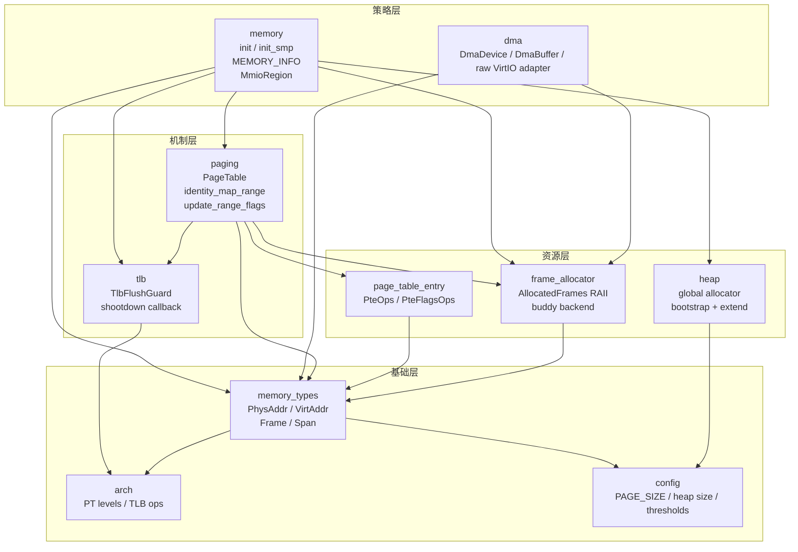
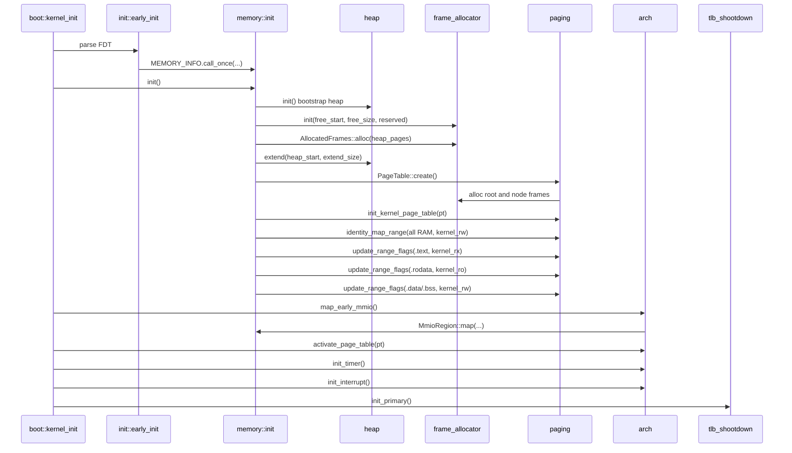
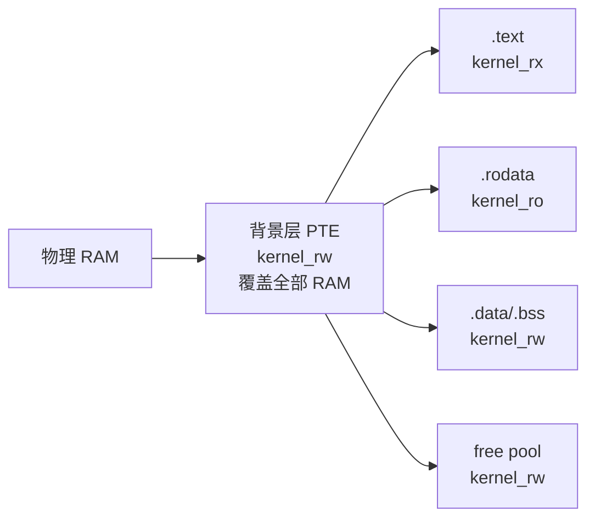
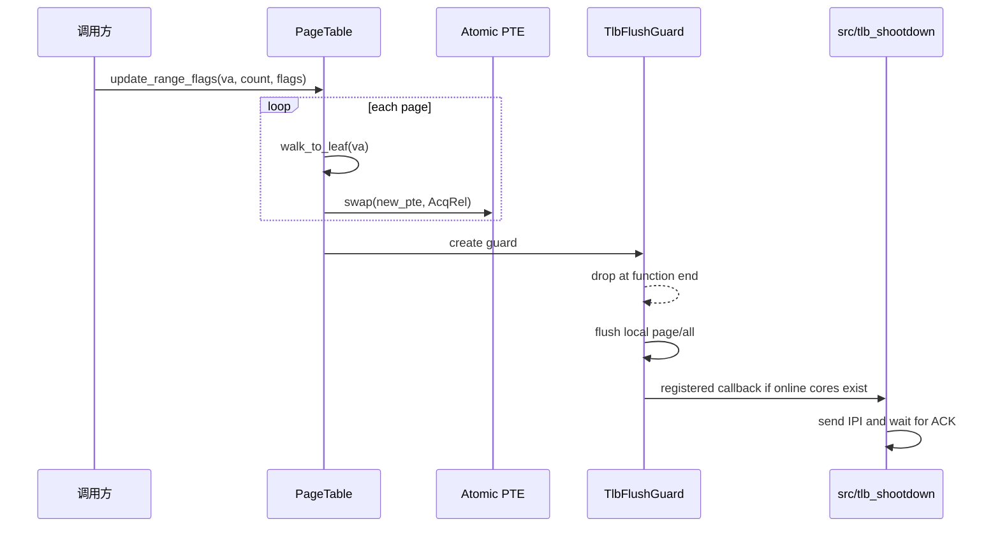
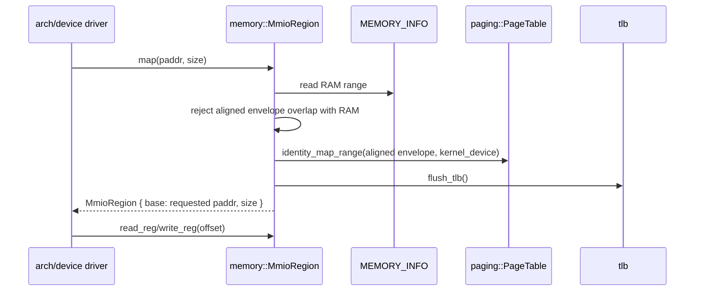
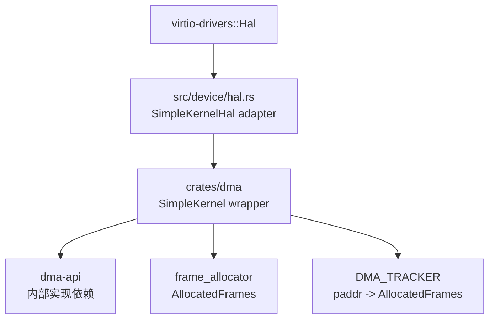

<!-- Copyright The SimpleKernel Contributors -->

# 内存管理子系统 v2

> 当前文档描述 SimpleKernel 现行内存子系统设计。历史设计见
> [memory-subsystem.md](memory-subsystem.md)；已删除的 `OwnedPages` / `Frames<S>`
> typestate 方案见 [ADR-013](../adr/013-ownedpages-necessity.md) 和
> [ADR-008](../adr/008-eliminate-frame-state-typestate.md)。

SimpleKernel 采用单地址空间（SAS）模型：内核启动时将全部物理 RAM identity-map 到同值虚拟地址，
运行时不删除 PTE。页表在当前内核侧主要承担权限覆盖和 MMIO Device 属性表达，而不是传统
“按需创建映射”的职责。

## 设计目标

- 所有物理帧生命周期由 Rust 所有权表达：`AllocatedFrames` 不可 `Clone` / `Copy`，Drop 时归还 buddy。
- 页表节点只增不删：无锁 walker 不需要 RCU 或引用计数。
- 内存初始化顺序闭环：引导堆、帧分配器、完整堆、页表、权限覆盖、MMIO 和 TLB flush 的顺序固定。
- MMIO 与 RAM 语义分离：MMIO 不经过帧分配器，`MmioRegion` 只表示硬件寄存器窗口。
- QEMU VirtIO DMA 与真机 DMA 语义分离：`crates/dma` 当前只承诺 QEMU identity mapping。

## 非目标

- 当前内核侧不提供通用 `mmap` / `munmap` / demand paging。
- 当前内核侧不回收页表节点。
- 当前 `dma` 后端不声明 non-coherent 真机 DMA 已正确。
- 用户态独立页表属于后续 P9/P10 方向，不复用内核 SAS 的权限覆盖模型。

## 分层架构



### 职责边界

| Crate | 职责 | 边界 |
|-------|------|------|
| `memory_types` | 地址、帧号和区间 newtype | 不做分配，不读页表 |
| `frame_allocator` | 分配和回收物理帧 | 不清零，不设置 PTE 权限 |
| `heap` | 内核全局堆 | 不选择物理帧；由 `memory::init` 提供扩展区 |
| `page_table_entry` | PTE 位编码和权限 preset | 不 walk 页表，不 flush TLB |
| `paging` | 页表 walk、创建 PTE、覆盖 flags | 不知道内存布局策略和 MMIO 业务含义 |
| `tlb` | 本核 TLB flush 和 shootdown 回调入口 | 不发送 IPI；IPI 在 `src/tlb_shootdown.rs` |
| `memory` | 内存初始化和 MMIO 类型化入口 | 不承诺 DMA cache 语义 |
| `dma` | DMA wrapper 和 QEMU identity 后端 | 不承诺 non-coherent 真机 DMA |

## 启动时序



主核先完成页表和早期 MMIO 映射，再激活页表。从核不重新构造页表，只通过
`memory::init_smp()` 复用主核已经初始化的全局内核页表。

## 物理帧生命周期

```mermaid
stateDiagram-v2
  [*] --> BuddyPool: frame_allocator::init()
  BuddyPool --> Allocated: AllocatedFrames::alloc(count)
  Allocated --> BuddyPool: Drop
  Allocated --> LeakedKernelLifetime: core::mem::forget()
  LeakedKernelLifetime --> [*]: 内核生命周期结束

  state Allocated {
    [*] --> Uninitialized: 返回给调用方
    Uninitialized --> Initialized: 调用方清零或写入内容
    Initialized --> UsedByPageTable: paging 节点帧
    Initialized --> UsedByHeap: heap 扩展帧
    Initialized --> UsedByDma: QEMU DMA buffer
  }
```

`frame_allocator` 只负责所有权，不负责内容初始化。不同调用方承担不同策略：

| 调用方 | 初始化策略 | 生命周期 |
|--------|------------|----------|
| `paging::alloc_node_frame()` | 清零为无效 PTE | 随 `PageTable` 持有 |
| `memory::init()` 堆扩展 | 交给 `heap::extend()` 管理 | `mem::forget` 永久持有 |
| `dma::QemuIdentityDmaOp` | 清零，避免泄漏给设备 | `DMA_TRACKER` 持有，dealloc 时释放 |
| 普通运行时分配 | 调用方决定 | `AllocatedFrames` Drop 归还 |

## 页表模型



`PageTable` 内部结构：

- `root: AllocatedFrames`：根页表帧，创建后不变。
- `nodes: SpinLock<Vec<AllocatedFrames>>`：中间页表节点所有权，只在创建新 PTE 时持锁。
- 单个 PTE 通过 `AtomicU64` 读写：`read` 使用 Acquire，`write` 使用 Release，`swap` 使用 AcqRel。

`identity_map_range(start, end, flags)` 负责创建 PTE。它接收 byte range，因为 FDT、
MMIO 描述符和 RAM 范围天然以字节边界表达。

`update_range_flags(va, page_count, flags)` 只修改已存在 PTE 的 flags。它接收页数，
因为权限覆盖、DMA 区域和未来 `mprotect` 这类调用天然按页计数。

## 权限覆盖时序



跨页权限覆盖不是原子的。调用方如果需要整段不可分切换，需要在更高层建立互斥或
stop-the-world 协议。当前 `.text/.rodata/.data` 覆盖发生在从核上线前，不存在多核观察窗口。

## MMIO 模型



MMIO 地址是设备寄存器，不是 RAM：

- 不由 `frame_allocator` 分配，也不会归还。
- 映射使用 `PteFlags::kernel_device()`。
- 访问使用 `read_volatile` / `write_volatile`。
- `MmioRegion` 不提供 unmap；启动期和设备发现期建立的 MMIO 映射永久存在。

## DMA 模型



`src/device/hal.rs` 只做外部 `virtio-drivers::Hal` trait 适配。DMA 策略集中在
`crates/dma`：

- `raw_alloc_pages()`：供 VirtIO queue 等 raw coherent allocation 使用。
- `raw_dealloc_pages()`：按 tracker 校验 paddr、vaddr 和页数后释放。
- `raw_map_single()` / `raw_unmap_single()`：QEMU identity streaming 地址转换。
- `DmaDevice` / `DmaBuffer<T>` / `DmaArray<T>` / `StreamingMapping<T>`：SimpleKernel 自己的 typed wrapper。

当前后端只表达 QEMU VirtIO identity mapping。真机支持需要另行设计：

- streaming map/unmap 的 cache clean / invalidate；
- coherent DMA RAM 的 PTE 属性；
- DMA mask、IOMMU、bounce buffer 或设备 capability。

## 并发与中断安全

| 路径 | 同步策略 |
|------|----------|
| 帧分配 | `SpinLockIrq<FrameAllocator<32>>`，避免同核中断重入死锁 |
| 堆分配 | `SpinLock<Heap<32>>`，入口断言不在中断上下文 |
| 页表建节点 | `PageTable.nodes: SpinLock<Vec<AllocatedFrames>>` |
| PTE 读写 | `AtomicU64`，节点只增不删 |
| TLB shootdown | `tlb` 注册回调，`src/tlb_shootdown.rs` 发送 IPI 并等待 ACK |
| DMA tracker | `SpinLock<BTreeMap<u64, AllocatedFrames>>` |

TLB shootdown 在主核中断控制器初始化后注册。从核完成本核中断初始化后标记 online。
注册前的 TLB flush 只影响本核；这覆盖启动早期“只有主核在线”的阶段。

## 错误处理策略

- 启动期内存布局错误、页表节点 OOM、PTE 冲突、MMIO 和 RAM 重叠属于内核 bug，直接 panic。
- 运行时物理帧耗尽通过 `FrameAllocError::OutOfMemory` 返回给调用方。
- DMA raw helper 通过 `DmaError` 返回可诊断错误，`virtio-drivers::Hal` adapter 再按 trait 约束转换为 panic 或 `-1`。

## 验证入口

容器内常用验证：

```bash
cargo fmt --all -- --check
cargo xtask check --arch riscv64
cargo xtask check --arch aarch64
timeout 30s cargo xtask test --arch riscv64 --name frame-alloc-test
timeout 30s cargo xtask test --arch riscv64 --name heap-test
timeout 30s cargo xtask test --arch riscv64 --name paging-table-test
timeout 30s cargo xtask test --arch riscv64 --name tlb-shootdown-test
timeout 30s cargo xtask test --arch riscv64 --name device-test
```

所有 QEMU 相关命令必须设置 30 秒超时；超时后清理残留 `qemu-system` 进程。

## 文档维护规则

- 修改内存层职责或依赖方向时，同步更新 [crates/AGENTS.md](../../crates/AGENTS.md)。
- 修改 `PageTable` / `AllocatedFrames` / `MmioRegion` / DMA 边界时，同步更新对应 crate README 或 AGENTS。
- 变更已经接受的架构决策时，新建或更新 ADR；AI 生成的新 ADR 初始状态必须为“提议”。
- 历史设计文档可以保留，但必须在顶部标明已过时并指向当前文档。
