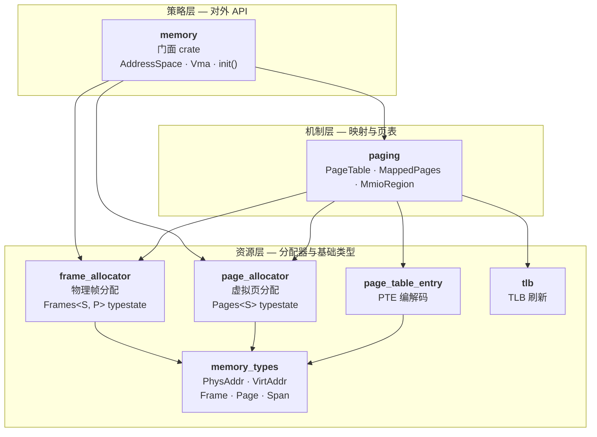
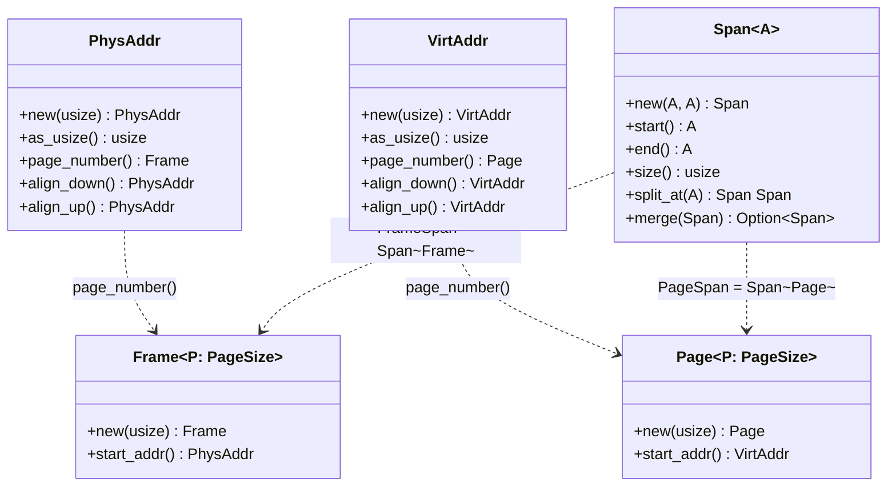
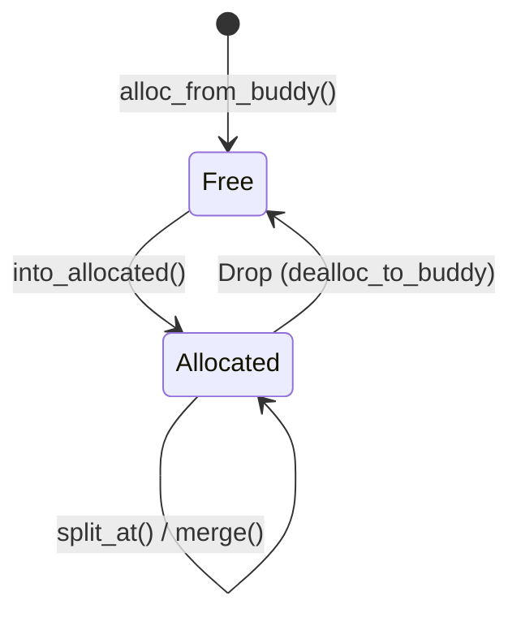
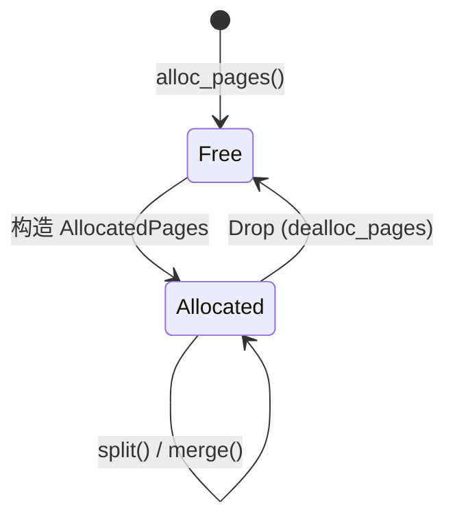
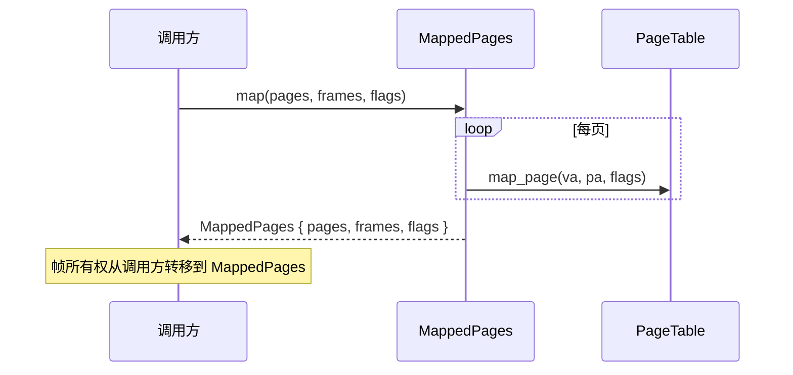
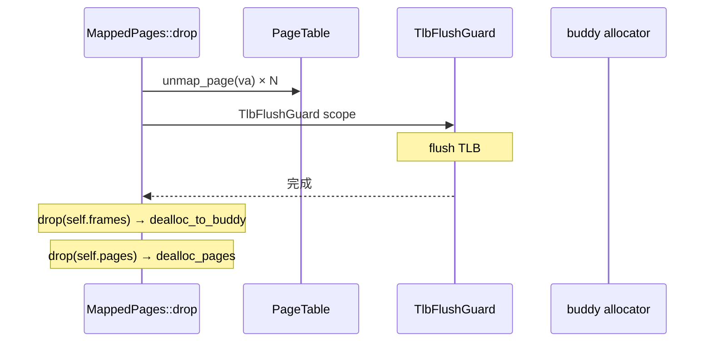
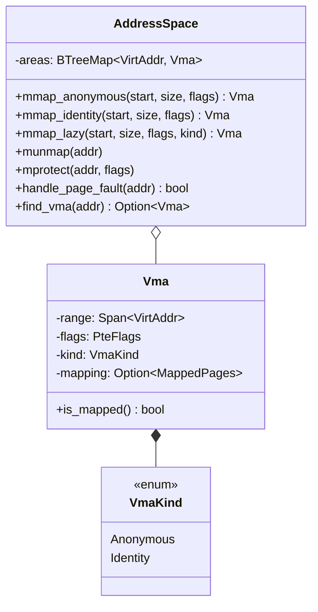
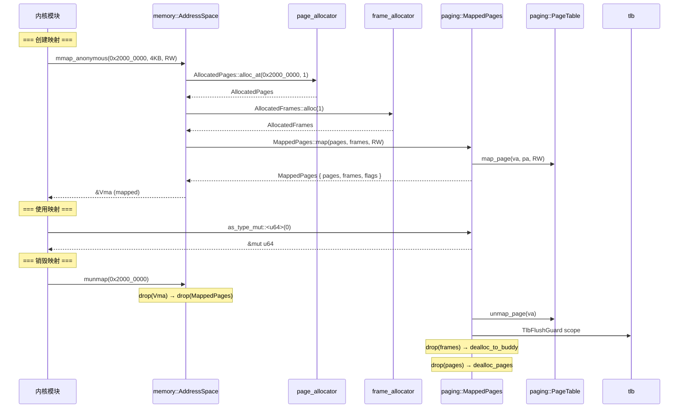
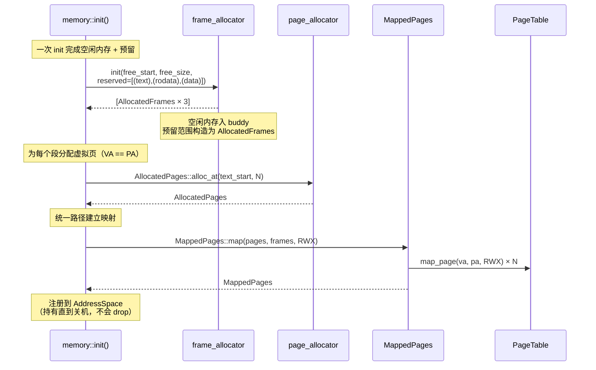
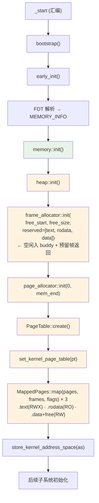

# 内存管理子系统

> 本文档面向**内核开发者**，系统描述 SimpleKernel 内存管理的设计意图、类型层次、
> 所有权模型和生命周期流转。读完本文你应该能回答：
>
> - 一个物理帧从分配到回收经历了哪些类型状态？
> - `MappedPages` 如何保证 unmap 后帧不泄漏？
> - 各 crate 之间的职责边界在哪里？
> - 为什么物理帧必须连续分配？

---

## 1. 架构总览

SimpleKernel 采用 **SAS（Single Address Space）** 架构——所有代码运行在同一特权级和
同一地址空间中，VA == PA（identity mapping）。隔离通过 Rust 类型系统和 crate 可见性实现。

内存子系统由 7 个 crate 组成，分为三层：



### 各层职责

| 层 | Crate | 职责 | 不做什么 |
|----|-------|------|---------|
| **策略** | `memory` | VMA 管理、便捷映射函数、初始化编排、全局状态 | 不直接操作 PTE |
| **机制** | `paging` | 多级页表遍历、PTE 读写、MappedPages RAII 映射、MmioRegion volatile 访问 | 不决定"映射什么"也不分配帧——由上层告知 |
| **资源** | `frame_allocator` | 物理帧的分配/回收/typestate 追踪 | 不知道页表的存在 |
| **资源** | `page_allocator` | 虚拟页的分配/回收 | 不知道物理帧的存在 |
| **资源** | `page_table_entry` | 单个 PTE 的 bit-level 编解码（跨架构） | 不做页表遍历 |
| **资源** | `memory_types` | 地址/页号/帧号 newtype、Span 区间 | 无运行时状态 |
| **资源** | `tlb` | 架构相关的 TLB invalidate | RAII guard，scope 结束时 flush |

---

## 2. 基础类型——`memory_types`

所有内存操作的基石是编译期区分物理/虚拟的 newtype：



**设计意图**：`PhysAddr` 和 `VirtAddr` 在类型层面不可互换——把 PA 传给期望 VA
的函数是编译错误。`Frame`/`Page` 是页粒度的标识，自带 `PageSize` 泛型参数
（`Page4K`/`Page2M`/`Page1G`）。

---

## 3. 物理帧生命周期——`frame_allocator`

### 3.1 Typestate 状态机

物理帧使用 **const generic typestate** 追踪生命周期。
与 `page_allocator` 对称设计，只有两个状态：



帧与页表的关系不由 frame_allocator 追踪——由持有 `AllocatedFrames` 的
`MappedPages` 结构体隐式表达：

| 帧在哪 | 等价状态 | 谁追踪 |
|--------|---------|--------|
| 在 buddy 中 | 空闲 | buddy allocator |
| 被用户持有（`AllocatedFrames`） | 已分配，未映射 | Rust 所有权 |
| 在 `MappedPages.frames` 字段里 | 已分配，已映射 | struct 字段所有权 |
| `MappedPages::drop` 执行中 | 正在取消映射 | Drop 执行顺序 |

### 3.2 核心类型

```rust
pub struct Frames<const S: MemoryState, P: PageSize = Page4K> {
    range: FrameSpan,        // 连续物理帧的半开区间 [start, end)
    _marker: PhantomData<P>, // 页大小标记（4K/2M/1G）
}

pub enum MemoryState {
    Free,       // 分配器持有
    Allocated,  // 用户持有
}

// 便利别名
pub type FreeFrames = Frames<{Free}, Page4K>;
pub type AllocatedFrames<P = Page4K> = Frames<{Allocated}, P>;
```

### 3.3 分配器后端与初始化

```
┌─────────────────────────────────────────────────────────┐
│        SpinLockIrq 保护                                  │
│  ┌─────────────────────────────┐                        │
│  │ buddy_system_allocator<32>  │                        │
│  │  Order 32 → 最大 2^32 页    │                        │
│  │  ≈ 16 TB 连续分配           │                        │
│  └─────────────────────────────┘                        │
│  alloc_from_buddy(count) → FreeFrames                    │
│  dealloc_to_buddy(range)                                 │
│                                                          │
│  init(free_start, free_size, reserved) → [AllocatedFrames]│
│       ↑ 空闲内存入 buddy      ↑ 预留范围构造为帧         │
└─────────────────────────────────────────────────────────┘
```

- 全局单例，`SpinLockIrq` 保护（关中断防止死锁）
- `init()` 是唯一的初始化入口，接受两类参数：
  - `free_start`/`free_size`：空闲内存范围，加入 buddy
  - `reserved`：需要预留的物理地址范围列表（如内核 .text/.rodata/.data 段），
    **不经过 buddy**——直接构造为 `AllocatedFrames` 返回给调用方
- `alloc(count)` — 自动选址分配连续帧（运行时常规分配）

**为什么预留范围不经过 buddy？**
`buddy_system_allocator` 只支持 `alloc(count)` 返回 buddy 选择的地址，
不支持定点分配（`alloc_at`）。内核段的物理地址由链接器/固件决定，
必须精确预留。`init` 函数在内部直接构造 `AllocatedFrames`（`pub(crate)` 的
`from_range`），不将这些范围加入 buddy——调用方拿到的是正常的 `AllocatedFrames`，
后续使用完全 safe。

**内核段帧的生命周期**：由 `AddressSpace` 通过 `MappedPages` 持有直到关机，
永远不会被 drop。如果被意外 drop，`dealloc_to_buddy` 会将这些帧"额外"加入
buddy 池——这不是正确行为，但不会导致 UB（仅是多出了一些帧）。

### 3.4 连续帧分配——设计选择

`AllocatedFrames` 是单个连续范围——映射 N 页需要 N 个连续物理帧。
这是 SAS identity mapping（VA == PA）下的**自然约束**，同时带来性能优势：

| 好处 | 原因 |
|------|------|
| TLB 压力低 | 连续帧可合并为大页（2MB/1GB），一条 TLB 条目覆盖更多地址 |
| 硬件预取有效 | CPU prefetcher 按物理地址模式预取，连续 PA 让 sequential access 命中 |
| DMA 友好 | 大多数 DMA 控制器要求物理连续 buffer |
| 映射简单 | 一个 `FrameSpan` 范围，不需要 scatter-gather 列表 |

这与 Linux 的 `kmalloc`（物理连续，优先选择）vs `vmalloc`（虚拟连续物理散布，
不得已才用）是同一个取舍。SAS 设计天然站在 `kmalloc` 一侧——物理连续是唯一模式。

### 3.5 `mem::forget` 模式

`split_at` 和 `merge` 使用 `mem::forget` 模式——消费旧值的所有权但跳过其 Drop，
从其字段构造新值，防止中间状态触发 `dealloc_to_buddy`：

```rust
pub fn split_at(self, mid: Frame<P>) -> (Self, Self) {
    let (left, right) = self.range.split_at(mid);
    core::mem::forget(self);  // 阻止旧 Drop
    (Self::from_range(left), Self::from_range(right))
}
```

---

## 4. 虚拟页生命周期——`page_allocator`

与 `frame_allocator` 对称设计：



```rust
pub struct Pages<const S: MemoryState> {
    range: PageSpan,
}
pub type AllocatedPages = Pages<{Allocated}>;
```

**分配策略**：BTreeMap-based free list（不是 buddy），支持：
- `alloc(count)` — first-fit 自动选址
- `alloc_at(va, count)` — 指定地址分配
- `reserve(va, size)` — 启动时扣除已占用区域
- 回收时自动合并相邻空闲区间

---

## 5. RAII 映射——`MappedPages`

### 5.1 设计原则

`MappedPages` 遵循**单一职责**：建立 VA→PA 映射 + RAII 保证 unmap + 持有帧所有权。

- **不分配帧**——调用方负责提供 `AllocatedFrames`
- **不决定 VA==PA 还是 VA!=PA**——调用方负责地址选择
- **不决定帧来源**——buddy 分配的帧和 `alloc_at` 预留的帧一视同仁
- **帧所有权始终在 Rust 类型系统中**——无 `mem::forget`，无 unsafe 恢复路径

### 5.2 结构

```rust
pub struct MappedPages {
    pages: AllocatedPages,      // 虚拟页所有权
    frames: AllocatedFrames,    // 物理帧所有权
    flags: PteFlags,            // 用户请求的权限
}
// 不可 Clone，不可 Copy——move-only 仿射类型
```

### 5.3 编译期保证

帧存在结构体中，所有权始终由 Rust 类型系统追踪：

| 保证 | 如何实现 |
|------|---------|
| 帧不会 double-free | Rust 所有权唯一——编译期强制 |
| 帧不会泄漏 | `MappedPages::drop` 必然执行——编译期强制 |
| unmap 一定回收帧 | Drop 释放 `self.frames` 字段——编译期强制 |
| 映射存活期间帧不被回收 | 字段与 struct 同生命周期——编译期强制 |

对比 PTE EXCLUSIVE 位方案（Theseus 等）：

| | EXCLUSIVE 方案 | 帧存 struct（本设计） |
|--|---------------|---------------------|
| 帧所有权追踪 | PTE 软件位（运行时） | struct 字段（编译期） |
| 所有权交接 | `mem::forget` + `unsafe from_unmapped_range` | 无——不离开类型系统 |
| 安全网 | Mapped 状态 Drop panic（运行时） | 不需要——编译器保证 |
| COW 支持 | per-PTE EXCLUSIVE 位天然支持 | SAS 下不需要 COW |

### 5.4 为什么不用 EXCLUSIVE 位？

**SAS 架构下 EXCLUSIVE 位没有使用场景。**

EXCLUSIVE 位解决的问题是：unmap 时区分"该回收的帧"和"不该回收的帧"。
需要这种区分的场景在 SAS 下都不存在：

| 场景 | 传统 OS | SAS |
|------|---------|-----|
| COW fork | 共享帧，EXCLUSIVE=0 | 没有 fork，共享靠 Rust 引用 |
| 共享内存 | 多进程各映射同一帧 | 同一地址空间，传 `&T` 即可 |
| 非分配器管理的帧 | MMIO、固件保留区 | MMIO 走 `MmioRegion` 独立路径 |

初始化时空闲 RAM 加入 buddy，内核段通过 `init` 的 `reserved` 参数直接构造
`AllocatedFrames`���—所有 `MappedPages` 持有的帧都有明确所有者，都应该被回收。

### 5.5 创建——`map`

`MappedPages` 只有一个创建路径——调用方提供 pages 和 frames：

```rust
/// 唯一的创建路径——消费 pages 和 frames 的所有权建立映射。
///
/// 调用方决定 VA/PA 的对应关系：
///   - identity map: 确保 pages.start_vaddr() == frames.start_paddr()
///   - 匿名映射: pages 和 frames 可以是任意地址
pub fn map(pages: AllocatedPages, frames: AllocatedFrames, flags: PteFlags) -> Self
```



### 5.6 销毁——Drop



**Drop 顺序**：先清 PTE → flush TLB → 再 drop frames。
编译器保证字段按声明逆序 drop，但 PTE 清除和 TLB 刷新在 `drop` 方法体内
显式执行，确保时序正确。

### 5.7 类型化内存访问

```rust
// 安全读取映射区域中的类型化数据
let val: &MyStruct = mapped_pages.as_type::<MyStruct>(offset);

// 安全可变访问（自动检查 PTE WRITE 权限）
let val: &mut MyStruct = mapped_pages.as_type_mut::<MyStruct>(offset);
```

返回引用的生命周期绑定到 `&self` / `&mut self`——编译器保证映射 drop 后
引用不可使用。`zerocopy::FromBytes` trait bound 保证任意位模式均合法。

### 5.8 split / merge / mprotect

| 操作 | 语义 | 帧处理 |
|------|------|--------|
| `split(index)` | 拆分为两个 `MappedPages` | `AllocatedFrames::split_at` 同步拆分 |
| `merge(other)` | 合并相邻且 flags 相同的映射 | `AllocatedFrames::merge` 同步合并（帧必须连续） |
| `mprotect(flags)` | 修改权限 | 不影响帧 |

---

## 6. MMIO 区域——`MmioRegion`

MMIO 地址是硬件寄存器，**不是 RAM**，不在 buddy allocator 中。
`MmioRegion` 直接使用 `PageTable` 的 `pub(crate)` 方法建立映射，
不经过 `MappedPages`：

```rust
pub struct MmioRegion {
    pages: AllocatedPages,       // 虚拟页所有权
    // 无 frames 字段——MMIO 帧不归分配器管
}
```

- `read_reg<T>` / `write_reg<T>` 使用 **volatile** 语义
- 映射永久存在（生命周期等于设备驱动）
- 与 `MappedPages` 是同一 crate 的平级类型，各自独立

---

## 7. 地址空间与 VMA——`memory` crate

`memory` crate 是面向内核其他模块的**唯一公共 API**。

### 7.1 VMA（Virtual Memory Area）



### 7.2 便捷函数与帧分配

帧分配和地址选择在 `memory` 层完成——`MappedPages` 不参与：

```rust
// memory crate 中的便捷函数示意
pub fn mmap_anonymous(&mut self, start, size, flags) -> Result<&Vma, MemoryError> {
    let pages = AllocatedPages::alloc_at(start, page_count)?;
    let frames = AllocatedFrames::alloc(page_count)?;  // 从 buddy 分配
    let mapping = MappedPages::map(pages, frames, flags);  // 统一入口
    // ...注册 VMA
}
```

内核段 identity mapping 在 `memory::init()` 中完成，使用 `frame_allocator::init`
返回的预留帧：

```rust
// memory::init() 中的内核段映射
let reserved_frames = unsafe {
    frame_allocator::init(free_start, free_size, &[
        (mem_start, text_pages),     // .text+.boot
        (text_end, rodata_pages),    // .rodata（含 .symtab/.strtab）
        (rodata_end, rest_pages),    // .data+.bss+空闲内存
    ])
};
// reserved_frames[0..3] 传入 MappedPages::map 建立分段映射
```

**所有 `MappedPages::map` 调用形式相同**——区别只在帧来源（buddy 分配 vs init 预留）。

### 7.3 所有 MappedPages 统一 Drop

不再需要 `ManuallyDrop` 区分 identity 和 anonymous：

| 场景 | 帧来源 | Drop 行为 |
|------|--------|-----------|
| 匿名映射 | `AllocatedFrames::alloc(N)` | unmap + 回收帧 + 回收页 |
| 内核段（init） | `init` 返回的预留帧 | 由 `AddressSpace` 持有直到关机，不会 drop |

---

## 8. 端到端生命周期——完整示例

### 8.1 匿名映射的一生



### 8.2 Identity 映射（内核段）的一生



**映射范围与调试信息**：三段映射覆盖完整内核镜像和全部空闲 RAM：

| 段 | 范围 | 权限 | 包含的关键内容 |
|----|------|------|---------------|
| .boot + .text | `[mem_start, text_end)` | RWX | 函数代码（backtrace 需要） |
| .rodata | `[text_end, rodata_end)` | RO | `.symtab`/`.strtab`（地址→函数名）、`.eh_frame`（栈展开） |
| .data + .bss + free | `[rodata_end, mem_end)` | RW | 全局变量、栈内存、buddy 管理的空闲帧 |

`.rodata` 段包含 ELF 符号表——如果未映射，backtrace 只能输出裸地址，无法解析函数名。

---

## 9. 页表内部机制——`paging::PageTable`

### 9.1 结构

```rust
pub struct PageTable {
    root_paddr: PhysAddr,                   // 根帧物理地址
    root: NodeFrame,                        // 持有根帧所有权
    root_ref_count: u16,                    // 根帧中有效 PTE 数
    nodes: BTreeMap<PhysAddr, NodeEntry>,   // 中间节点帧 + 引用计数
}
```

### 9.2 多级页表遍历

```
           Level 3 (root)           riscv64: Sv39 = 3 级
           ┌──────────┐             aarch64: 4 级
           │ 512 PTEs │
           └────┬─────┘
                │ PTE[vpn[3]]
           Level 2
           ┌──────────┐
           │ 512 PTEs │         ← 1GB 大页可在此终止
           └────┬─────┘
                │ PTE[vpn[2]]
           Level 1
           ┌──────────┐
           │ 512 PTEs │         ← 2MB 大页可在此终止
           └────┬─────┘
                │ PTE[vpn[1]]
           Level 0
           ┌──────────┐
           │ 512 PTEs │         ← 4KB 叶页
           └──────────┘
```

### 9.3 引用计数自动回收

中间节点帧通过引用计数管理——当一个帧中的所有 PTE 都被 unmap（ref_count = 0），
该中间帧自动从 `nodes` BTreeMap 中移除并释放。

### 9.4 可见性封装

```rust
// 页表写操作是 pub(crate)——外部 crate 无法直接调用
pub(crate) fn map_page(&mut self, va, pa, flags) -> Result<(), PagingError>
pub(crate) fn unmap_page(&mut self, va) -> Result<PhysAddr, PagingError>
pub(crate) fn update_flags(&mut self, va, flags) -> Result<PteFlags, PagingError>

// 只有同 crate 的 MappedPages / MmioRegion 能调用
// → 所有映射的创建和销毁必须通过 RAII 类型
```

---

## 10. 初始化顺序



**约束**：
- 堆必须在帧分配器之前初始化（buddy allocator 内部使用堆）
- `init()` 一次性完成：空闲内存入 buddy + 内核段帧构造并返回
- 页表创建后才能建立映射
- 所有映射（包括内核段 identity map）都走 `MappedPages::map` 统一路径
- 内核段映射由 `AddressSpace` 持有直到关机——确保 `.symtab` 等调试信息始终可访问
- 从核（SMP）复用主核页表，只需激活分页

---

## 11. 错误处理

各层定义自己的错误类型，`memory` crate 提供统一转换：

```
FrameAllocError ──────┐
  AllocationFailed     │   From impl
  OutOfMemory          ├──────────────→ MemoryError
                       │                  AllocationFailed
PagingError ──────────┘                  OutOfMemory
  AllocationFailed                        MapFailed
  AlreadyMapped                           PageNotMapped
  HugePageConflict                        InvalidPageTable
  PageNotMapped                           RegionOverlap
  FrameAllocFailed                        RegionNotFound
```

---

## 12. 与 Theseus OS 的对比

SimpleKernel 的内存管理受 Theseus 影响，但在 SAS 约束下做了进一步简化：

| 特性 | SimpleKernel | Theseus |
|------|-------------|---------|
| 帧所有权追踪 | struct 字段（编译期） | PTE EXCLUSIVE 位（运行时） |
| 帧 typestate | 2 状态：Free / Allocated | 4 状态：Free / Allocated / Mapped / Unmapped |
| MappedPages 持有帧？ | **是**——`AllocatedFrames` 字段 | 否——帧沉入 PTE |
| 所有权交接 | 无 forget、无 unsafe | `mem::forget` + `unsafe from_unmapped_range` |
| MappedPages 创建方式 | `map(pages, frames, flags)` 统一入口 | `map_allocated_pages_to` + `map_to_non_exclusive` |
| 共享映射 / COW | 不支持（SAS 不需要） | EXCLUSIVE 位支持 |
| 初始化策略 | 空闲 RAM 入 buddy + `init` 预留内核帧 | 分阶段，部分内存不入分配器 |

**SimpleKernel 的选择**：SAS 下没有多地址空间，不需要 COW 和共享映射，
因此用更简单的"帧存 struct"方案获得更强的编译期保证。
Theseus 的 EXCLUSIVE 方案更通用，但额外的复杂度在 SAS 下没有收益。

---

## 13. unsafe 边界总结

| 位置 | unsafe 操作 | 不变量 |
|------|------------|--------|
| `frame_allocator::init()` | 空闲内存入 buddy + 预留范围构造帧 | 区间有效、互不重叠、仅调用一次 |
| `page_allocator::init()` | 将 VA 空间加入分配器 | 区间有效、仅调用一次 |
| `AllocatedFrames::alloc()` | 零初始化：`write_bytes(phys_to_virt(pa), 0, size)` | 帧刚分配，无其他引用 |
| `set_kernel_page_table()` | 存储 `'static` 引用 | 引用确实是 `'static` |
| `Table::from_paddr()` | 将 PA 转为 PTE 数组指针 | PA 指向有效、页对齐的帧 |
| `MappedPages::as_type{_mut}()` | 从 VA 创建类型化引用 | 映射存活、偏移和对齐已验证 |
| `MmioRegion` 内部 PTE 操作 | 对 MMIO 地址建立映射 | 调用方确保 PA 是有效设备地址 |

注意：相比 EXCLUSIVE 方案，**`UnmappedFrames::from_unmapped_range()` 不再存在**——
这是本设计消除的最大 unsafe 点。

所有 `unsafe` 块都有 `// SAFETY:` 注释说明不变量。
