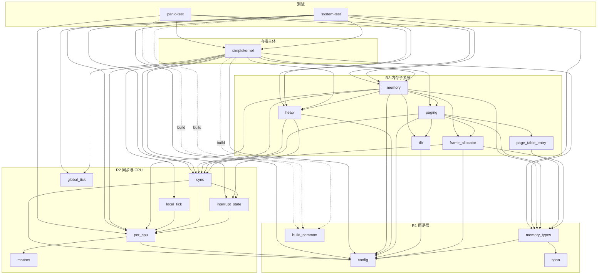

# Crate 依赖关系图

> **生成日期**：2026-04-03
> **生成方式**：`cargo metadata --no-deps` 自动提取
> **分支**：`feat/rust-SAS`

## Workspace 内部依赖

## 外部依赖（按 crate）

| Workspace Crate | 外部依赖 |
|----------------|---------|
| `build_common` | cc |
| `config` | log |
| `frame_allocator` | buddy_system_allocator, log |
| `heap` | buddy_system_allocator, log |
| `interrupt_state` | aarch64-cpu, riscv |
| `macros` | proc-macro2, quote, syn |
| `memory` | log, spin, zerocopy |
| `page_table_entry` | bitflags |
| `paging` | log, spin |
| `per_cpu` | aarch64-cpu, tock-registers |
| `simplekernel` | aarch64-cpu, arm-gic, arm-psci, bitfield-struct, bitflags, buddy_system_allocator, cc, elf, fatfs, fdt, gdbstub, hashbrown, heapless, intrusive-collections, log, qemu-exit, riscv, rustc-demangle, sbi-rt, smoltcp, spin, tock-registers, unwinding, virtio-drivers |
| `sync` | *(无直接外部依赖)* |
| `tlb` | aarch64-cpu, riscv, spin |
| `xtask` | clap, xshell |
