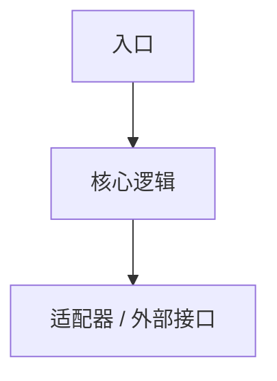

# TODO 路径/模块 AGENTS.md

> **使用说明**
>
> 复制到模块、crate、测试包、硬件子系统或重要目录根部，并改名为 `AGENTS.md`。局部 `AGENTS.md` 只记录该目录的局部规则；跨项目通用规则仍由根目录 `AGENTS.md` 和 `docs/conventions.md` 负责。

## 模块概览

- 路径：TODO
- 职责：TODO
- 不负责：TODO
- 所属层次/边界：TODO
- 目标运行环境：TODO

## 对外暴露

| 类型 | 名称/路径 | 稳定性 | 说明 |
|------|-----------|--------|------|
| trait / type / command / test | TODO | TODO | TODO |

## 内部结构

## 依赖约束

允许依赖：

- TODO

禁止依赖：

- TODO

新增依赖前必须检查：

- [ ] 是否跨越根目录 `AGENTS.md` 声明的架构边界。
- [ ] 是否能通过 trait、接口、配置或适配器降低耦合。
- [ ] 是否需要 ADR/RFC 记录。

## 修改规则

| 改动 | 必须同步更新 |
|------|--------------|
| 公开 API 或数据结构变化 | 调用方、测试、文档 |
| 配置或命令变化 | README、SOP、CI |
| 硬件或外部接口变化 | 硬件设计、供应商记录、SOP |

## 验证

| 命令/步骤 | 运行位置 | 需要硬件/外部服务 | 超时 | 说明 |
|-----------|----------|--------------------|------|------|
| TODO | TODO | TODO | TODO | TODO |

## 关联文档

- ADR/RFC：TODO
- Spec/Plan：TODO
- 硬件/供应商/SOP：TODO
