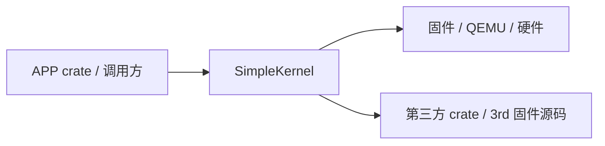
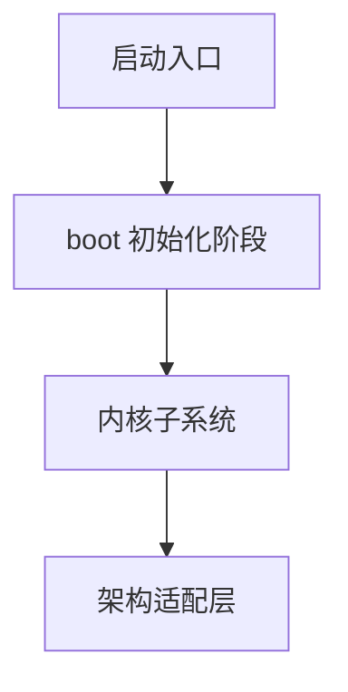
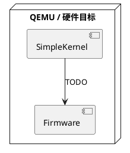

# TODO Software Architecture Document (SAD)

> **使用说明**
>
> 复制为 `docs/design/sad-*.md` 或 `docs/SAD.md` 后填写。SAD 描述当前架构状态，不记录临时实施步骤；决策理由应引用 `docs/adr/` 中的 ADR。

## 文档信息

- 项目/子系统：TODO
- 适用版本/阶段：TODO
- 状态：草案 / 已接受 / 已废弃
- 最后审阅日期：YYYY-MM-DD
- 关联 ADR/RFC/Spec/Plan：TODO

## 目标与范围

### 目标

- TODO

### 非目标

- TODO

### 利益相关方

| 角色 | 关注点 | 责任边界 |
|------|--------|----------|
| TODO | TODO | TODO |

## 架构上下文

说明本系统与 APP crate、固件、硬件、QEMU、第三方源码、生产流程和供应商交付物的边界。

## 架构约束

| 约束 | 来源 | 影响 | 验证方式 |
|------|------|------|----------|
| TODO | TODO | TODO | TODO |

## 逻辑视图

| 模块 | 职责 | 不负责 | 公开边界 |
|------|------|--------|----------|
| TODO | TODO | TODO | TODO |

## 运行时视图

| 运行单元 | 触发/频率 | 调度/隔离 | 资源所有权 | 失败处理 |
|----------|-----------|-----------|------------|----------|
| TODO | TODO | TODO | TODO | TODO |

## 硬件与固件视图

| 边界 | 本项目负责 | 外部/供应商负责 | 验收方式 | 关联文档 |
|------|------------|------------------|----------|----------|
| TODO | TODO | TODO | TODO | TODO |

## 数据与接口视图

| 接口/数据流 | 方向 | 协议/格式 | 真值源 | 兼容性要求 |
|-------------|------|-----------|--------|------------|
| TODO | TODO | TODO | TODO | TODO |

## 质量属性

| 属性 | 目标 | 设计策略 | 验证方式 |
|------|------|----------|----------|
| 安全性 | TODO | TODO | TODO |
| 可靠性 | TODO | TODO | TODO |
| 实时性 | TODO | TODO | TODO |
| 可维护性 | TODO | TODO | TODO |
| 可测试性 | TODO | TODO | TODO |

## 架构风险与技术债

| 风险/技术债 | 影响 | 触发条件 | 缓解/计划 |
|-------------|------|----------|-----------|
| TODO | TODO | TODO | TODO |

## 关联决策

| ADR/RFC | 决策 | 本文影响 |
|---------|------|----------|
| TODO | TODO | TODO |
